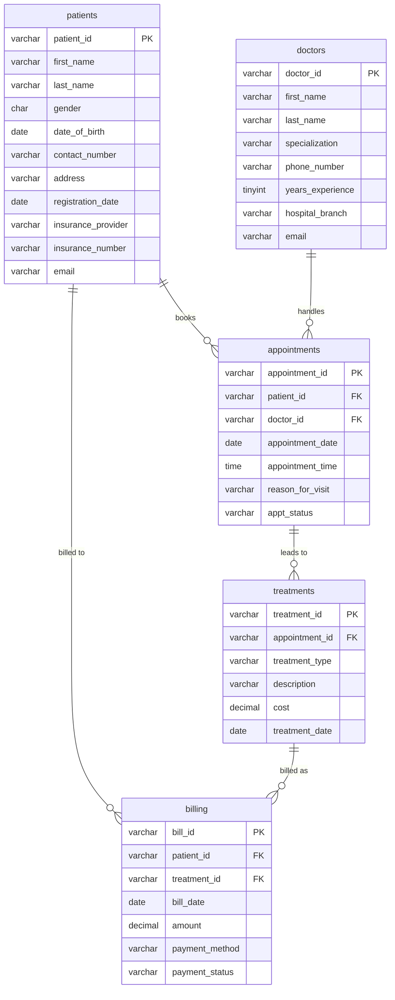
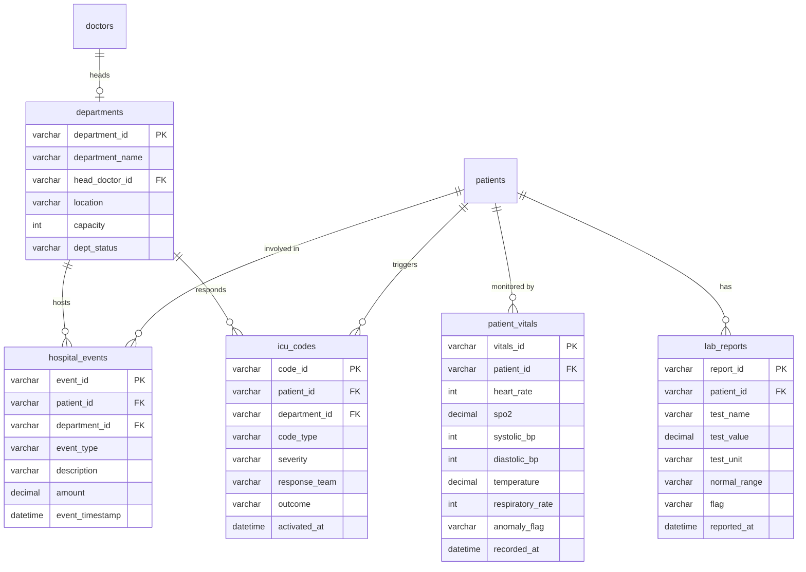
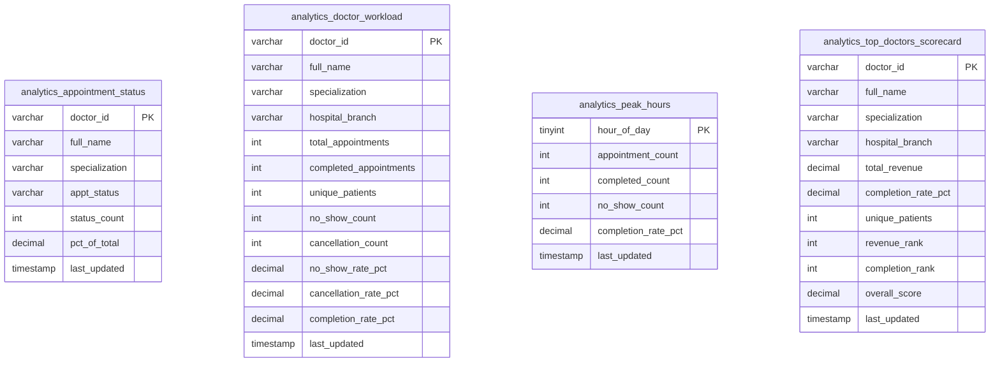
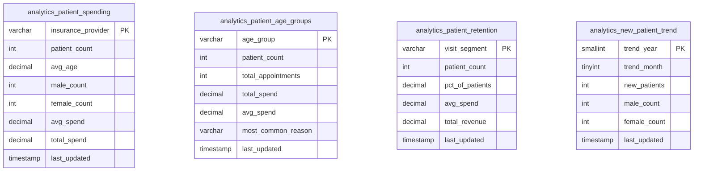
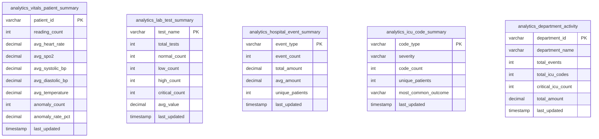

# ER Diagrams — Healthcare Data Platform

Detailed entity-relationship diagrams for all 30 tables in the `healthcare` MySQL database.
Each diagram is generated from the actual SQL schema files.

- **Operational tables** — `EC21/mysql/init.sql` (10 tables: 5 clinical + 5 monitoring, real FK constraints)
- **Analytics tables** — `EC22/airflow/dags/analytical_schema.sql` (20 tables, no FK constraints — daily Spark snapshots)

---

## 1. Operational Tables — `init.sql`

Five core transactional tables. Foreign keys, cardinalities, and cascade rules match `init.sql` exactly.

> `appointments.appt_status` maps to the column `status` in the database
> (`status` is a reserved word in Mermaid's parser).
> `patients.email` and `doctors.email` carry a UNIQUE constraint (not shown — Mermaid does not support UK).

| FK Constraint | Column | References | ON DELETE |
|---|---|---|---|
| fk_appt_patient | appointments.patient_id | patients.patient_id | CASCADE |
| fk_appt_doctor | appointments.doctor_id | doctors.doctor_id | RESTRICT |
| fk_treat_appointment | treatments.appointment_id | appointments.appointment_id | CASCADE |
| fk_bill_patient | billing.patient_id | patients.patient_id | CASCADE |
| fk_bill_treatment | billing.treatment_id | treatments.treatment_id | RESTRICT |

---

## 2. Monitoring Operational Tables — `init.sql` (5 tables)

Five monitoring and clinical-observation tables. All are processed by `monitoring_job.py`.
`departments` seeds before patients/vitals to satisfy FK references.

| FK Constraint | Column | References | ON DELETE |
|---|---|---|---|
| fk_dept_head | departments.head_doctor_id | doctors.doctor_id | SET NULL |
| fk_vitals_patient | patient_vitals.patient_id | patients.patient_id | CASCADE |
| fk_lab_patient | lab_reports.patient_id | patients.patient_id | CASCADE |
| fk_event_patient | hospital_events.patient_id | patients.patient_id | CASCADE |
| fk_event_dept | hospital_events.department_id | departments.department_id | RESTRICT |
| fk_icu_patient | icu_codes.patient_id | patients.patient_id | CASCADE |
| fk_icu_dept | icu_codes.department_id | departments.department_id | RESTRICT |

---

## 3. Financial Analytics — `analytical_schema.sql` (7 tables)

Pre-aggregated by `EC22/spark/jobs/financial_analytics.py`. No FK constraints between tables.
All tables include `last_updated TIMESTAMP` (refreshed every daily Airflow run).

> Composite PKs: `analytics_billing_payment(payment_method, payment_status)` and
> `analytics_monthly_revenue(year, month)` — rendered with a single PK column here;
> the actual composite key is noted in each entity comment.

```mermaid
erDiagram
    analytics_revenue_by_doctor {
        varchar   doctor_id       PK
        varchar   full_name
        varchar   specialization
        varchar   hospital_branch
        int       total_bills
        decimal   total_revenue
        decimal   avg_bill_amount
        decimal   max_bill_amount
        timestamp last_updated
    }

    analytics_revenue_by_specialization {
        varchar   specialization        PK
        int       doctor_count
        int       total_appointments
        decimal   total_revenue
        decimal   avg_revenue_per_doc
        decimal   avg_revenue_per_appt
        timestamp last_updated
    }

    analytics_revenue_by_branch {
        varchar   hospital_branch       PK
        int       doctor_count
        int       total_appointments
        decimal   total_revenue
        decimal   avg_revenue_per_appt
        timestamp last_updated
    }

    analytics_billing_payment {
        varchar   payment_method        PK
        varchar   payment_status
        int       bill_count
        decimal   total_amount
        decimal   avg_amount
        decimal   pct_of_total_revenue
        timestamp last_updated
    }

    analytics_outstanding_payments {
        varchar   payment_status        PK
        int       bill_count
        decimal   total_outstanding
        decimal   avg_outstanding
        date      oldest_bill_date
        timestamp last_updated
    }

    analytics_monthly_revenue {
        smallint  rev_year              PK
        tinyint   rev_month
        int       bill_count
        decimal   total_revenue
        decimal   avg_revenue
        decimal   mom_growth_pct
        timestamp last_updated
    }

    analytics_treatment_cost {
        varchar   treatment_type        PK
        int       treatment_count
        decimal   avg_cost
        decimal   min_cost
        decimal   max_cost
        decimal   total_cost
        timestamp last_updated
    }
```

---

## 4. Operational Analytics — `analytical_schema.sql` (4 tables)

Pre-aggregated by `EC22/spark/jobs/operational_analytics.py`. No FK constraints between tables.

> Composite PK: `analytics_appointment_status(doctor_id, status)` — rendered with `doctor_id` as PK.
> Column `status` renamed `appt_status` and `count` renamed `status_count` (Mermaid reserved words).

---

## 5. Patient Analytics — `analytical_schema.sql` (4 tables)

Pre-aggregated by `EC22/spark/jobs/patient_analytics.py`. No FK constraints between tables.

> Composite PK: `analytics_new_patient_trend(year, month)` — rendered with `trend_year` as PK.
> `year` and `month` renamed `trend_year` / `trend_month` (Mermaid conflicts with SQL function names).

---

## 6. Monitoring Analytics — `analytical_schema.sql` (5 tables)

Pre-aggregated by `EC22/spark/jobs/monitoring_analytics.py`. No FK constraints between tables.
These tables feed the **Monitoring** dashboard page.

