# Healthcare Data Platform
## Project Documentation

**Version:** 1.0
**Date:** May 2026
**Author:** [Your Name]
**Institution:** [Your Institution / Organization]
**Project Type:** End-to-End Data Engineering Platform
**Deployment:** AWS EC2 — ap-south-1 (Mumbai)

---

## Table of Contents

1. [Introduction](#1-introduction)
   - 1.1 Problem Statement
   - 1.2 Motivation
   - 1.3 Document Scope
2. [Project Overview](#2-project-overview)
   - 2.1 Objectives
   - 2.2 Project Scope
   - 2.3 Technology Stack
   - 2.4 Project Timeline
3. [System Architecture](#3-system-architecture)
   - 3.1 High-Level Architecture
   - 3.2 EC21 — Streaming Pipeline Architecture
   - 3.3 EC22 — Analytics & Dashboard Architecture
   - 3.4 End-to-End Data Flow
   - 3.5 Technology Selection Rationale
4. [UML Diagrams](#4-uml-diagrams)
   - 4.1 Use Case Diagram
   - 4.2 Class Diagram
   - 4.3 Sequence Diagram — Data Ingestion
   - 4.4 Sequence Diagram — Batch Analytics
   - 4.5 Sequence Diagram — AI Chat
   - 4.6 Activity Diagram — Flink Validation
   - 4.7 Activity Diagram — Airflow DAG
   - 4.8 Deployment Diagram
5. [Functional Requirements](#5-functional-requirements)
   - 5.1 Data Ingestion Requirements
   - 5.2 Stream Processing Requirements
   - 5.3 Batch Analytics Requirements
   - 5.4 Dashboard & AI Requirements
6. [Non-Functional Requirements](#6-non-functional-requirements)
   - 6.1 Performance
   - 6.2 Reliability & Availability
   - 6.3 Scalability
   - 6.4 Security
   - 6.5 Maintainability
7. [AWS Setup & Execution](#7-aws-setup--execution)
   - 7.1 AWS Account & EC2 Provisioning
   - 7.2 Security Group Configuration
   - 7.3 EC21 Deployment Steps
   - 7.4 EC22 Deployment Steps
   - 7.5 Verification & Execution Guide
8. [Data Model](#8-data-model)
   - 8.1 Operational Schema — ERD
   - 8.2 Analytical Tables Reference
   - 8.3 Data Dictionary
9. [Testing](#9-testing)
   - 9.1 Testing Strategy
   - 9.2 Unit Tests — Flink Validators
   - 9.3 Integration Tests
   - 9.4 System / End-to-End Tests
   - 9.5 Bugs Found & Fixed
10. [API Documentation](#10-api-documentation)
    - 10.1 Financial, Operational & Patients Routers
    - 10.2 Pipeline, DataEntry & Infrastructure Routers
    - 10.3 Chat Router — SSE Protocol
11. [Future Enhancements & Conclusion](#11-future-enhancements--conclusion)
    - 11.1 Future Enhancements
    - 11.2 Conclusion
    - 11.3 References & Appendix

---

# 1. Introduction

## 1.1 Problem Statement

Healthcare organizations are among the most data-intensive institutions in the world. A single hospital generates thousands of records daily — patient registrations, doctor appointments, medical treatments, and billing transactions. Despite the volume and criticality of this data, most healthcare systems suffer from the following structural problems:

**Data Fragmentation:** Operational data is spread across multiple disconnected systems — patient management, appointment scheduling, billing, and treatment records each live in separate silos. There is no unified platform that provides a real-time, holistic view of hospital operations.

**Delayed Analytics:** Most hospitals rely on nightly or weekly batch exports to Excel or static report generators. By the time an analyst queries the data, it is already hours or days old. Real-time decisions — such as identifying which doctor has the most pending appointments, or which specialization is generating the most revenue today — are simply not possible with this model.

**No Natural Language Interface:** Healthcare analysts and administrators are not always technical. Expecting them to write SQL queries or navigate complex BI dashboards creates a barrier to insight. There is a strong need for a system that allows users to ask questions in plain English and receive accurate, data-backed answers.

**Lack of Infrastructure Visibility:** Modern cloud-native data platforms run dozens of services. Without a centralized monitoring view, operations teams cannot quickly determine which services are healthy, which have failed, and what the current state of data pipelines is.

This project addresses all four problems by building a complete, production-realistic healthcare data platform from ground up.

## 1.2 Motivation

The motivation for this project is threefold:

1. **Demonstrate Full-Stack Data Engineering:** Most portfolio projects cover one layer — either a Kafka producer, a Spark job, or a React dashboard. This project integrates every layer of the modern data stack into a single, cohesive system.

2. **Real-World Deployment on AWS:** All components run on actual AWS EC2 instances using Docker Compose, not local machines or simulated environments. This demonstrates practical knowledge of cloud deployment, networking, and container orchestration.

3. **AI-Augmented Analytics:** By integrating LangChain and a large language model (LLaMA 4 Scout via Groq), the platform demonstrates how AI can act as a data analyst — querying databases, checking pipeline health, and synthesizing insights in response to natural language questions.

## 1.3 Document Scope

This document provides comprehensive technical documentation for the Healthcare Data Platform project. It covers:

- System architecture and design decisions
- UML diagrams (use case, class, sequence, activity, deployment)
- Complete functional and non-functional requirements
- AWS infrastructure setup and step-by-step deployment guide
- Database schema and data dictionary
- Testing strategy and results
- Full REST API documentation
- Known bugs, their root causes, and the fixes applied
- Future enhancement roadmap

---

# 2. Project Overview

## 2.1 Objectives

The Healthcare Data Platform is designed to achieve the following measurable objectives:

| # | Objective | Metric |
|---|---|---|
| O-01 | Ingest healthcare events in real-time | 10 Kafka topics (5 clinical + 5 monitoring), 2-second event interval |
| O-02 | Validate every event before persistence | 10 validators, invalid records logged separately |
| O-03 | Persist operational data with idempotent upserts | MySQL, ON DUPLICATE KEY UPDATE pattern |
| O-04 | Orchestrate daily batch analytics | Airflow DAG, schedule 02:00 UTC |
| O-05 | Compute 20 KPI aggregation tables | 4 PySpark jobs, 7 + 4 + 4 + 5 tables |
| O-06 | Provide an interactive analytics dashboard | 8 React pages, 8 FastAPI routers |
| O-07 | Enable AI-powered natural language querying | LLaMA 4 + 8 live tools |
| O-08 | Monitor infrastructure health in real-time | 10 service probes (HTTP + TCP) |

## 2.2 Project Scope

**In Scope:**
- Real-time data ingestion using Apache Kafka (10 topics: 5 clinical + 5 monitoring)
- Stream processing and validation using Apache Flink (PyFlink, 2 jobs)
- Operational data storage in MySQL 8.0 (10 tables: 5 clinical + 5 monitoring, port 3308)
- Daily batch analytics orchestration using Apache Airflow 2.9.3
- Batch computation using Apache Spark 3.5.0 (PySpark, 20 analytics tables)
- REST API backend using FastAPI (8 routers)
- Interactive frontend using React + Vite + Tailwind CSS (8 pages)
- AI chat interface using LangChain + Groq (LLaMA 4 Scout, 8 tools)
- Infrastructure health monitoring (10 services, HTTP + TCP probes)
- Data entry via dashboard forms to Kafka (all 10 entity types)
- Full containerized deployment on AWS EC2 using Docker Compose

**Out of Scope:**
- User authentication and role-based authorization
- Multi-region or multi-broker Kafka cluster
- Data encryption at rest or in transit (TLS/SSL)
- CI/CD pipeline (GitHub Actions, Jenkins, etc.)
- External BI tools (Grafana, Metabase, Tableau)
- Mobile application (iOS/Android)
- Data archival or cold storage (S3, Glacier)
- Alerting and on-call notifications (PagerDuty, SNS)

## 2.3 Technology Stack

| Category | Technology | Version | Purpose |
|---|---|---|---|
| Cloud | AWS EC2 | — | 2× m7i-flex.large instances, ap-south-1 |
| Containerization | Docker + Docker Compose | Latest | All services containerized |
| Messaging | Apache Kafka (Confluent) | 7.4.0 | Real-time event streaming, 10 topics |
| Coordination | Apache Zookeeper | (bundled) | Kafka broker coordination |
| Kafka UI | Provectus Kafka UI | Latest | Kafka topic monitoring at :8085 |
| Stream Processing | Apache Flink (PyFlink) | 1.18 | 2 Flink jobs — validate & write to MySQL |
| Operational DB | MySQL | 8.0 | 10 operational + 20 analytics tables |
| Data Faker | Faker (Python) | — | Synthetic healthcare data generation |
| Orchestration | Apache Airflow | 2.9.3 | DAG scheduling, LocalExecutor |
| Airflow Meta DB | PostgreSQL | 15 | Airflow internal state |
| Batch Processing | Apache Spark (PySpark) | 3.5.0 | Compute 15 analytics tables |
| API Backend | FastAPI + Uvicorn | 0.111.0 | 8 REST routers, SSE support |
| HTTP Client | httpx | 0.27.0 | Airflow + Flink REST calls |
| Kafka Client | kafka-python | 2.0.2 | Data entry producer |
| DB Client | pymysql | 1.1.0 | MySQL reads from FastAPI |
| AI Framework | LangChain | 0.3.x | Tool-calling loop, message history |
| AI Provider | Groq API | — | Free tier, 100K tokens/day |
| AI Model | LLaMA 4 Scout 17B | — | Natural language → tool calls |
| Frontend | React + Vite | 18 / 5.x | 8-page SPA dashboard |
| CSS Framework | Tailwind CSS | 3.x | Utility-first styling |
| Frontend Server | nginx | Alpine | Serves React build at :3000 |
| Language | Python | 3.11 | All backend, Flink, Spark, Airflow |
| Language | Node.js | 18 | React frontend build |

## 2.4 Project Timeline

| Phase | Activities | Duration |
|---|---|---|
| Phase 1 — Design | Architecture design, data model, schema design | Week 1 |
| Phase 2 — EC21 Build | Kafka setup, Flink job, producer, MySQL schema | Week 2 |
| Phase 3 — EC21 Deploy | AWS EC2 launch, Docker Compose deployment, testing | Week 3 |
| Phase 4 — EC22 Build | Airflow DAG, Spark jobs, FastAPI routers, React pages | Week 4–5 |
| Phase 5 — EC22 Deploy | AWS EC2 launch, full pipeline test, analytics verification | Week 6 |
| Phase 6 — Monitoring Expansion | monitoring_job.py, 5 monitoring topics, monitoring_analytics.py, Monitoring page | Week 7 |
| Phase 7 — AI Chat | LangChain integration, 8 tools, SSE streaming, Chat + Data Entry pages | Week 8 |
| Phase 8 — Testing & Docs | End-to-end testing, bug fixes, documentation | Week 9 |

---

# 3. System Architecture

## 3.1 High-Level Architecture

The platform is split across two AWS EC2 instances in the ap-south-1 (Mumbai) region. This separation reflects real-world architectural separation of concerns — streaming infrastructure is isolated from analytics and user-facing services.

```
┌──────────────────────────────────────────────────────────────────────────────┐
│                          AWS ap-south-1 (Mumbai)                             │
│                                                                              │
│  ┌──────────────────────────────┐     ┌────────────────────────────────────┐ │
│  │  EC21 — 65.0.80.152          │     │  EC22 — 3.6.92.19                  │ │
│  │  [Streaming Pipeline]        │     │  [Analytics + Dashboard + AI]      │ │
│  │                              │     │                                    │ │
│  │  Faker Producer              │     │  PostgreSQL (Airflow meta)         │ │
│  │      ↓                       │     │  Airflow Webserver + Scheduler     │ │
│  │  Kafka (:9092) 10 topics     │◄────│  Spark Master + Worker             │ │
│  │      ↓           ↑           │     │      ↓ reads + writes via JDBC     │ │
│  │  PyFlink x2   DataEntry      │     │  FastAPI Dashboard API (:8000)     │ │
│  │  (clinical +  from EC22      │     │      ↓                            │ │
│  │   monitoring)                │     │  React Dashboard UI (:3000)       │ │
│  │  MySQL (:3308)───────────────│────►│  [8 pages + AI Chat]              │ │
│  │  [10 operational tables]     │     │                                    │ │
│  │  [20 analytics tables]       │     │                                    │ │
│  └──────────────────────────────┘     └────────────────────────────────────┘ │
│                                                                              │
└──────────────────────────────────────────────────────────────────────────────┘
```

**Cross-instance communication:**
- EC22 → EC21 MySQL: JDBC connection to `65.0.80.152:3308` (Spark reads + writes, FastAPI reads)
- EC22 → EC21 Kafka: `kafka-python` producer to `65.0.80.152:9092` (Data entry from dashboard)
- EC22 → EC21 Flink UI: HTTP to `65.0.80.152:8081` (Infrastructure health probe, AI tool)
- EC22 → EC21 Kafka UI: HTTP to `65.0.80.152:8085` (Kafka topic info AI tool)

## 3.2 EC21 — Streaming Pipeline Architecture

EC21 hosts the complete real-time data ingestion and processing stack. All 8 containers run on a single Docker bridge network named `healthcare-net`.

**Container Dependency Graph:**
```
zookeeper (health: cub zk-ready)
    └──► kafka (health: kafka-topics --list)
              ├──► kafka-ui           [monitoring UI, :8085]
              ├──► producer           [restart:no — runs once]
              └──► flink-jobmanager   [health: curl :8081]
                        ├──► flink-taskmanager
                        └──► flink-job-submitter [restart:no]
                                    ↓
                              (submits healthcare_job.py  — 5 clinical topics)
                              (submits monitoring_job.py  — 5 monitoring topics)

mysql (health: mysqladmin ping) ←── flink-job-submitter depends on it
```

**Startup sequence enforced by `depends_on` with `condition: service_healthy`:**
1. Zookeeper starts and passes health check
2. Kafka starts (requires healthy Zookeeper), passes health check
3. MySQL starts independently, passes health check
4. Flink JobManager starts (requires healthy Kafka + MySQL), passes health check
5. Producer, Kafka UI, Flink TaskManager, Flink Job Submitter start

**Key configuration values:**
- Kafka internal listener: `kafka:29092` (container-to-container)
- Kafka external listener: `65.0.80.152:9092` (host + remote access)
- MySQL port: 3308 (non-default, avoids conflict with local MySQL installs)
- Flink checkpoint interval: 10,000 ms
- Flink parallelism: 1
- Flink task slots: 1

## 3.3 EC22 — Analytics & Dashboard Architecture

EC22 hosts Airflow, Spark, FastAPI, and the React frontend. All 8 containers run on a Docker bridge network named `ec22-net`.

**Container startup sequence:**
1. PostgreSQL starts and passes health check
2. Airflow Init runs DB migrations and creates admin user, then exits (`restart: no`)
3. Airflow Webserver and Scheduler start (require healthy PostgreSQL + completed airflow-init)
4. Spark Master starts independently, passes health check
5. Spark Worker starts (requires healthy Spark Master)
6. Dashboard API starts (requires healthy Airflow Webserver)
7. Dashboard UI starts (requires dashboard-api)

**Spark cluster configuration:**
- 1 master + 1 worker
- Worker: 2 cores, 2 GB memory
- Spark jobs submitted via Airflow SparkSubmitOperator using `conn_id=spark_default`
- spark_default connection: `spark://spark-master:7077`
- MySQL JAR mounted at `/opt/spark/jars/mysql-connector-j.jar`

## 3.4 End-to-End Data Flow

The complete lifecycle of a data record, from generation to AI-queryable insight:

**Step 1 — Generation (EC21):**
The Faker-based producer generates synthetic healthcare records. It first seeds 5 departments (DEPT01–DEPT05), 20 patients, and 10 doctors, then enters a loop generating 7 events per tick — one appointment, treatment, billing, patient_vitals, lab_report, hospital_event, and icu_code — every 2 seconds for 100 total ticks.

**Step 2 — Kafka Ingestion (EC21):**
Each record is serialized as JSON and published to one of 10 Kafka topics with the entity ID as the message key. Topics: `patients`, `doctors`, `departments`, `appointments`, `treatments`, `billing`, `patient_vitals`, `lab_reports`, `hospital_events`, `icu_codes`. Kafka stores messages durably in `kafka-data` volume.

**Step 3 — Flink Validation (EC21):**
Two PyFlink jobs run concurrently. `healthcare_job.py` consumes from 5 clinical topics; `monitoring_job.py` consumes from 5 monitoring topics. Each job uses `KafkaSource.builder()` and per-message processing:
- Parse JSON string to Python dict
- Run entity-specific validator (e.g., `validate_appointment()`, `validate_patient_vitals()`)
- If valid: convert to typed Flink Row → emit to main output → JdbcSink
- If invalid: emit to side output tagged `INVALID_TAG` → print to task logs

**Step 4 — MySQL Persistence (EC21):**
Valid records are batched (1,000ms or 100 rows) and written to MySQL via the JDBC sink using `ON DUPLICATE KEY UPDATE`. This ensures idempotent writes — if Flink replays a message from a checkpoint, the upsert prevents duplicate rows. All 10 operational tables are populated this way.

**Step 5 — Airflow Orchestration (EC22):**
At 02:00 UTC, the Airflow scheduler triggers `healthcare_analytics_pipeline`. The DAG verifies MySQL connectivity, initializes 20 analytical table schemas if not present, waits for Spark to be ready, then submits 4 Spark jobs in parallel.

**Step 6 — Spark Analytics (EC22 → EC21):**
Each PySpark job reads operational tables from EC21 MySQL via JDBC, computes aggregations using Spark DataFrame transformations and Window functions, and writes the results back to 20 `analytics_*` tables in the same EC21 MySQL database. The four jobs cover financial (7 tables), operational (4 tables), patient (4 tables), and monitoring (5 tables).

**Step 7 — Dashboard Serving (EC22):**
FastAPI exposes 8 REST routers. The financial, operational, patient, and monitoring routers query the analytics tables directly (single-table SELECTs, sub-100ms). The pipeline router proxies Airflow REST API. The infrastructure router runs live TCP/HTTP probes. The chat router invokes the LangChain agent.

**Step 8 — AI Querying (EC22 → multiple):**
When a user types a question in the Chat page, FastAPI runs the LangChain manual tool-calling loop. The LLM (LLaMA 4 Scout via Groq) decides which tools to call, executes them against live systems, and returns a synthesized markdown response streamed back via SSE.

## 3.5 Technology Selection Rationale

| Decision | Chosen | Alternative Considered | Reason |
|---|---|---|---|
| Message broker | Apache Kafka | RabbitMQ, AWS SQS | Kafka is the industry standard for high-throughput streaming; durable log, replay support |
| Stream processor | Apache Flink | Spark Structured Streaming | Flink is purpose-built for low-latency stateful stream processing; native PyFlink API |
| Batch orchestrator | Apache Airflow | Apache Luigi, Prefect | Airflow has the richest ecosystem, best UI, and is the most widely used in production |
| Batch compute | Apache Spark (PySpark) | Pandas, dbt | Spark scales horizontally; PySpark is familiar to Python data engineers |
| API framework | FastAPI | Flask, Django REST | FastAPI is async-native, auto-generates OpenAPI docs, ideal for SSE |
| AI model | LLaMA 4 Scout (Groq) | OpenAI GPT-4, Claude | Groq free tier (100K tokens/day) eliminates cost; LLaMA 4 supports tool calling |
| AI framework | LangChain | LlamaIndex, raw API | LangChain provides tool binding, message history, and structured tool call handling |
| Frontend | React + Vite + Tailwind | Vue.js, Angular | React ecosystem is largest; Vite provides fast HMR; Tailwind enables rapid UI development |

---

# 4. UML Diagrams

This chapter contains all UML diagrams generated directly from the actual codebase.
All diagrams use **Mermaid** syntax (renders natively on GitHub).

---

## 4.1 Class Diagram — Domain Entities (MySQL Schema)

Based on `EC21/mysql/init.sql` and Flink Row type definitions in `healthcare_job.py` and `monitoring_job.py`.

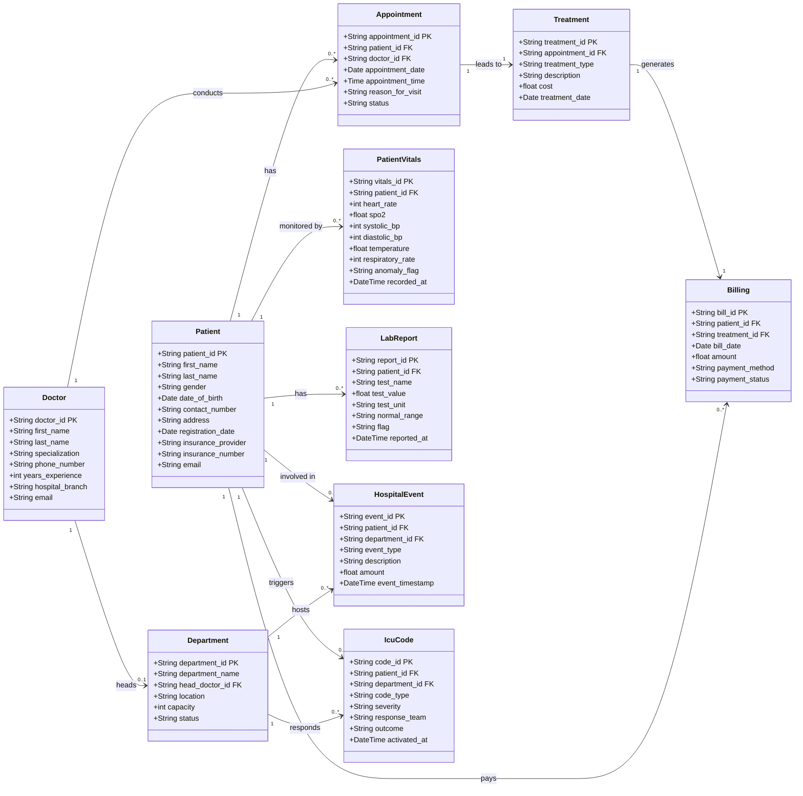

---

## 4.2 Class Diagram — Flink Stream Processing Pipeline

Based on `EC21/flink/jobs/healthcare_job.py` (5 clinical topics) and `EC21/flink/jobs/monitoring_job.py` (5 monitoring topics). Both jobs share the same structural pattern.

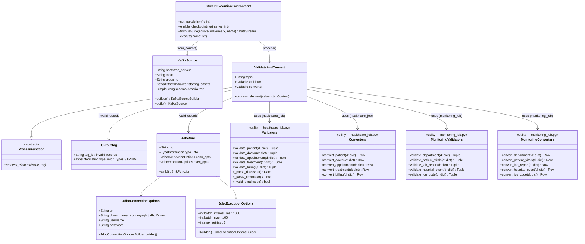

---

## 4.3 Class Diagram — FastAPI Application & Routers

Based on `EC22/dashboard/fastapi-backend/main.py`, `config.py`, `db.py`, and all router files.

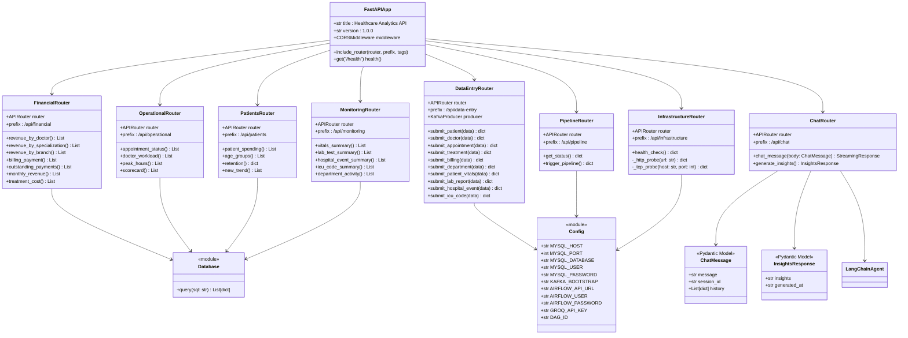

---

## 4.4 Class Diagram — LangChain AI Agent & Tools

Based on `EC22/dashboard/fastapi-backend/langchain_agent.py` and `tools.py`.

```mermaid
classDiagram
    direction TB

    class LangChainAgent {
        <<module>>
        +str SYSTEM_PROMPT
        +dict _TOOL_MAP
        +run_agent(input_text: str, chat_history: list) str
        -_to_lc_messages(history: list) List
        -_make_llm() ChatGroq
        +get_agent() _FakeAgentExecutor
    }

    class _FakeAgentExecutor {
        +ainvoke(inputs: dict) dict
    }

    class ChatGroq {
        +str model : llama-4-scout-17b-16e-instruct
        +str api_key
        +bool streaming : False
        +int max_tokens : 2048
        +int temperature : 0
        +bind_tools(tools: list) RunnableBinding
        +ainvoke(messages: list) AIMessage
    }

    class SystemMessage {
        +str content
    }

    class HumanMessage {
        +str content
    }

    class AIMessage {
        +str content
        +list tool_calls
    }

    class ToolMessage {
        +str content
        +str tool_call_id
    }

    class BaseTool {
        <<abstract>>
        +str name
        +str description
        +invoke(args: dict) str
    }

    class QueryAnalyticsDB {
        +name : query_analytics_db
        +invoke(sql: str) str
    }

    class GetPipelineStatus {
        +name : get_pipeline_status
        +invoke() str
    }

    class TriggerAnalyticsPipeline {
        +name : trigger_analytics_pipeline
        +invoke() str
    }

    class CheckInfrastructureHealth {
        +name : check_infrastructure_health
        +invoke() str
    }

    class GetKafkaTopicInfo {
        +name : get_kafka_topic_info
        +invoke() str
    }

    class GetFlinkJobStatus {
        +name : get_flink_job_status
        +invoke() str
    }

    class GetMySQLRowCounts {
        +name : get_mysql_row_counts
        +invoke() str
    }

    class GetMonitoringSummary {
        +name : get_monitoring_summary
        +invoke() str
    }

    LangChainAgent      --> _FakeAgentExecutor
    LangChainAgent      --> ChatGroq
    LangChainAgent      --> SystemMessage
    LangChainAgent      --> HumanMessage
    LangChainAgent      --> AIMessage
    LangChainAgent      --> ToolMessage
    LangChainAgent      --> QueryAnalyticsDB
    LangChainAgent      --> GetPipelineStatus
    LangChainAgent      --> TriggerAnalyticsPipeline
    LangChainAgent      --> CheckInfrastructureHealth
    LangChainAgent      --> GetKafkaTopicInfo
    LangChainAgent      --> GetFlinkJobStatus
    LangChainAgent      --> GetMySQLRowCounts
    LangChainAgent      --> GetMonitoringSummary
    QueryAnalyticsDB         ..|> BaseTool
    GetPipelineStatus        ..|> BaseTool
    TriggerAnalyticsPipeline ..|> BaseTool
    CheckInfrastructureHealth ..|> BaseTool
    GetKafkaTopicInfo        ..|> BaseTool
    GetFlinkJobStatus        ..|> BaseTool
    GetMySQLRowCounts        ..|> BaseTool
    GetMonitoringSummary     ..|> BaseTool
```

---

## 4.5 Class Diagram — Airflow DAG & Spark Analytics Jobs

Based on `EC22/airflow/dags/healthcare_analytics_dag.py`, `spark_cluster_sensor.py`, and all Spark job files.

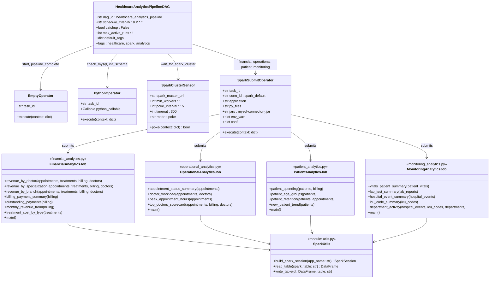

---

## 4.6 Activity Diagram — Faker Data Producer

Based on `EC21/producer/producer.py`.

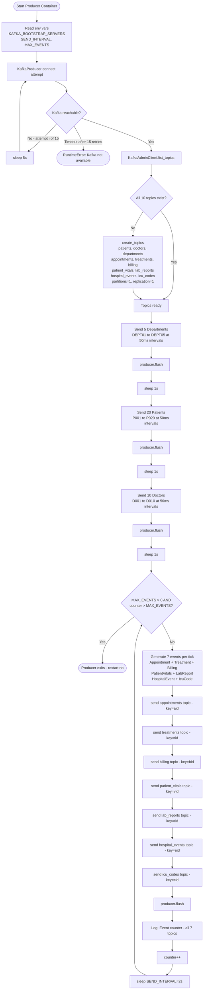

---

## 4.7 Activity Diagram — PyFlink Record Validation

Two Flink jobs run the same pattern. `healthcare_job.py` handles 5 clinical topics;
`monitoring_job.py` handles 5 monitoring topics. Diagram below covers both.

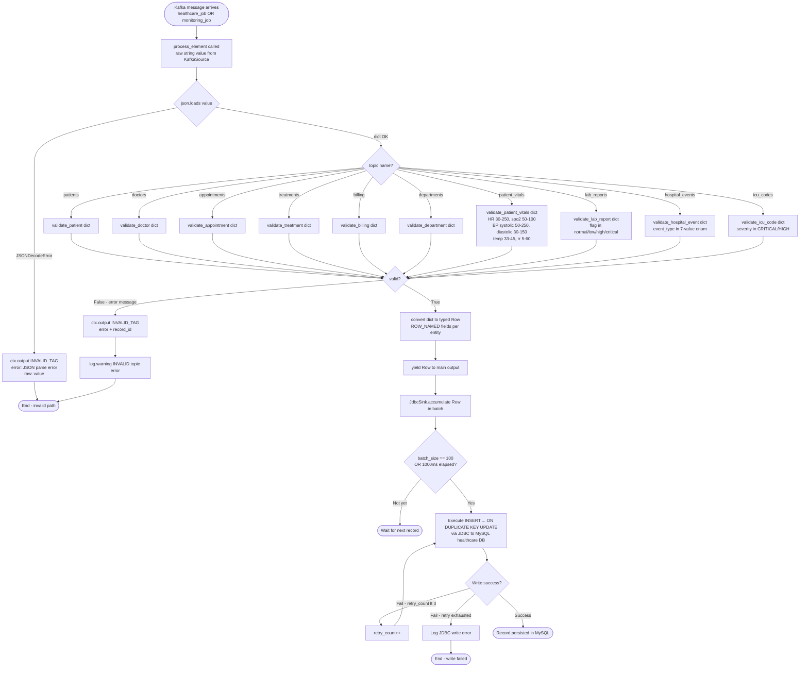

---

## 4.8 Activity Diagram — Airflow DAG Execution

Based on `EC22/airflow/dags/healthcare_analytics_dag.py`.

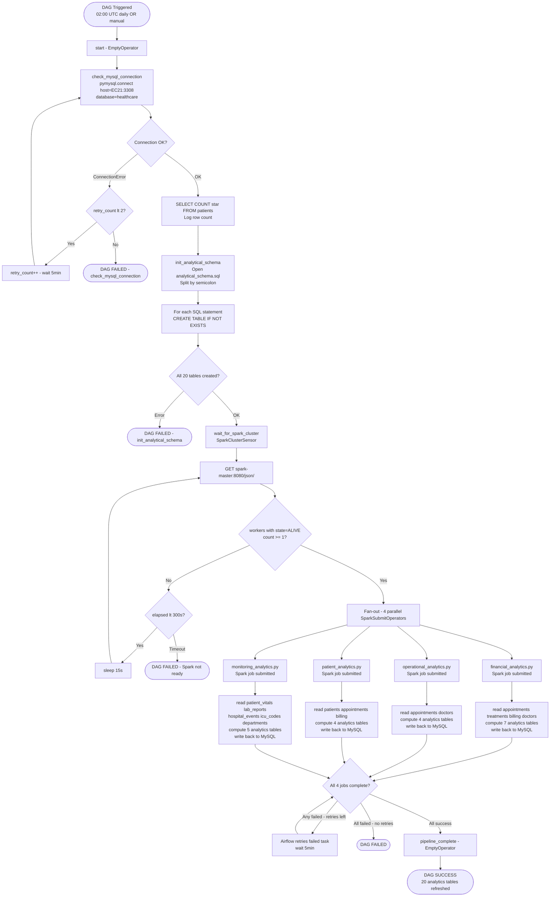

---

## 4.9 Activity Diagram — AI Chat Tool-Calling Loop

Based on `EC22/dashboard/fastapi-backend/langchain_agent.py` and `routers/chat.py`.

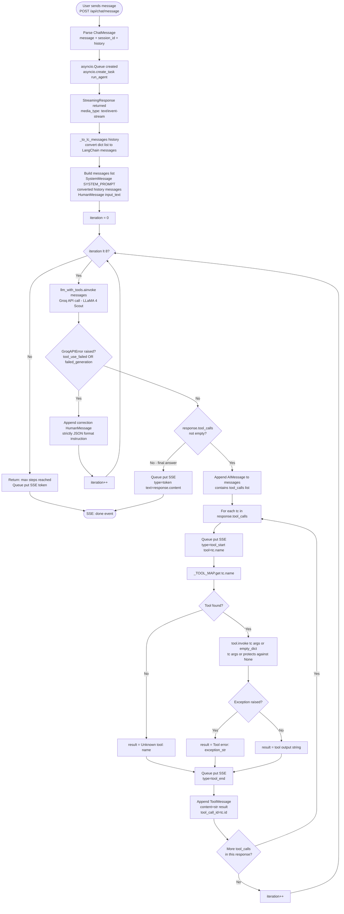

---

## 4.10 Activity Diagram — Dashboard Data Entry Flow

Based on `EC22/dashboard/fastapi-backend/routers/data_entry.py` and `EC22/dashboard/react-frontend/src/pages/DataEntry.jsx`.

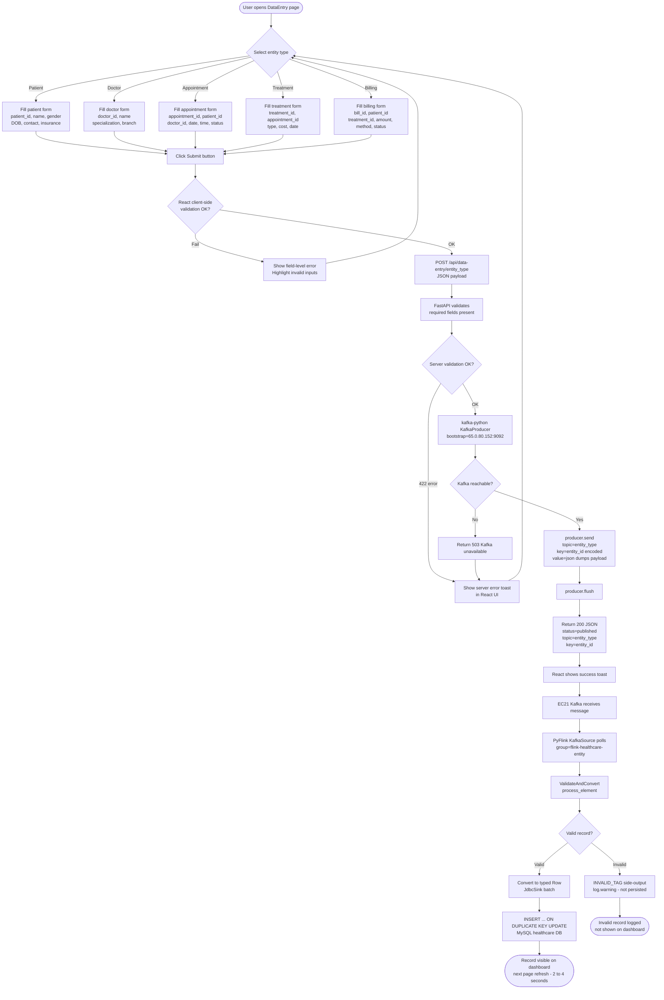


---

---

## 4.11 ER Diagram — Operational Tables (init.sql)

Entity-relationship diagrams for all 10 operational tables in the `healthcare` MySQL database (EC21).
Foreign-key direction, cardinality, and delete rules are taken directly from `EC21/mysql/init.sql`.

**5 Clinical tables:**
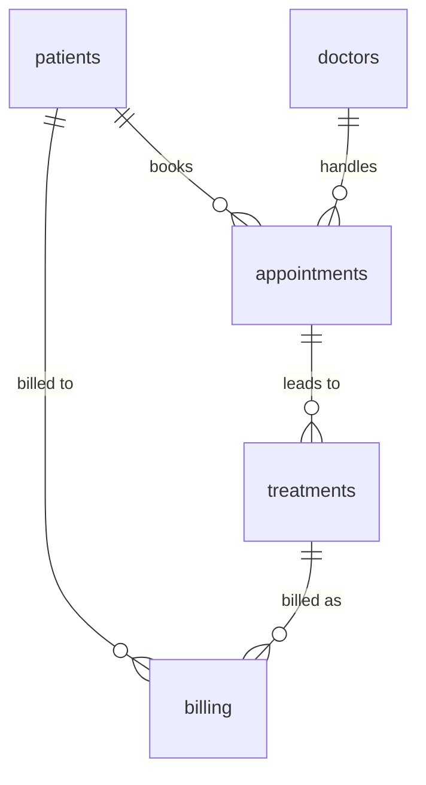

**5 Monitoring tables:**
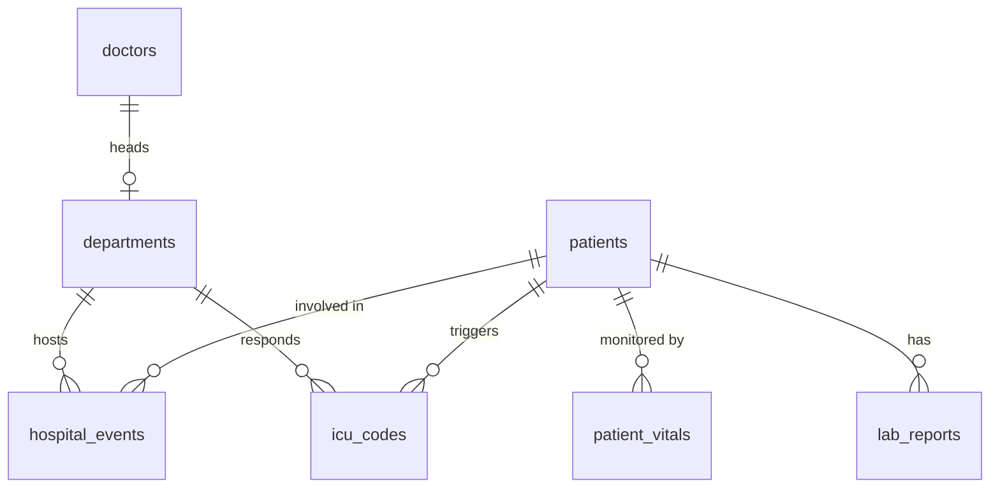

> **Full diagrams with all columns:** [ER_DIAGRAMS.md — Sections 1 & 2](./ER_DIAGRAMS.md)

### Column Reference — Clinical Tables

**patients** — `patient_id` PK · `first_name` · `last_name` · `gender` · `date_of_birth` · `contact_number` · `address` · `registration_date` · `insurance_provider` · `insurance_number` · `email` (UNIQUE)

**doctors** — `doctor_id` PK · `first_name` · `last_name` · `specialization` · `phone_number` · `years_experience` · `hospital_branch` · `email` (UNIQUE)

**appointments** — `appointment_id` PK · `patient_id` FK → patients (CASCADE) · `doctor_id` FK → doctors (RESTRICT) · `appointment_date` · `appointment_time` · `reason_for_visit` · `status`

**treatments** — `treatment_id` PK · `appointment_id` FK → appointments (CASCADE) · `treatment_type` · `description` · `cost` · `treatment_date`

**billing** — `bill_id` PK · `patient_id` FK → patients (CASCADE) · `treatment_id` FK → treatments (RESTRICT) · `bill_date` · `amount` · `payment_method` · `payment_status`

### Column Reference — Monitoring Tables

**departments** — `department_id` PK · `department_name` · `head_doctor_id` FK → doctors (SET NULL) · `location` · `capacity` · `dept_status`

**patient_vitals** — `vitals_id` PK · `patient_id` FK → patients (CASCADE) · `heart_rate` · `spo2` · `systolic_bp` · `diastolic_bp` · `temperature` · `respiratory_rate` · `anomaly_flag` · `recorded_at`

**lab_reports** — `report_id` PK · `patient_id` FK → patients (CASCADE) · `test_name` · `test_value` · `test_unit` · `normal_range` · `flag` · `reported_at`

**hospital_events** — `event_id` PK · `patient_id` FK → patients (CASCADE) · `department_id` FK → departments (RESTRICT) · `event_type` · `description` · `amount` · `event_timestamp`

**icu_codes** — `code_id` PK · `patient_id` FK → patients (CASCADE) · `department_id` FK → departments (RESTRICT) · `code_type` · `severity` · `response_team` · `outcome` · `activated_at`

---

## 4.12 Analytics Table Schemas (analytical_schema.sql)

All 20 pre-aggregated analytics tables written by Spark to the `healthcare` MySQL database (EC21).
These tables have **no FK constraints** — they are fully denormalised snapshots refreshed daily by Airflow.

> **Spark write pattern:** `mode("overwrite")` — each daily run fully replaces all rows.
> The `last_updated` TIMESTAMP reflects when each Spark job completed.

---

### Financial Analytics — 7 tables (`financial_analytics.py`)

| Table | Primary Key | Key Columns |
|---|---|---|
| `analytics_revenue_by_doctor` | `doctor_id` | full_name, specialization, hospital_branch, total_bills, total_revenue, avg_bill_amount, max_bill_amount |
| `analytics_revenue_by_specialization` | `specialization` | doctor_count, total_appointments, total_revenue, avg_revenue_per_doc, avg_revenue_per_appt |
| `analytics_revenue_by_branch` | `hospital_branch` | doctor_count, total_appointments, total_revenue, avg_revenue_per_appt |
| `analytics_billing_payment` | `(payment_method, payment_status)` | bill_count, total_amount, avg_amount, pct_of_total_revenue |
| `analytics_outstanding_payments` | `payment_status` | bill_count, total_outstanding, avg_outstanding, oldest_bill_date |
| `analytics_monthly_revenue` | `(year, month)` | bill_count, total_revenue, avg_revenue, mom_growth_pct |
| `analytics_treatment_cost` | `treatment_type` | treatment_count, avg_cost, min_cost, max_cost, total_cost |

---

### Operational Analytics — 4 tables (`operational_analytics.py`)

| Table | Primary Key | Key Columns |
|---|---|---|
| `analytics_appointment_status` | `(doctor_id, status)` | full_name, specialization, count, pct_of_total |
| `analytics_doctor_workload` | `doctor_id` | full_name, total_appointments, completed_appointments, unique_patients, no_show_count, cancellation_count, no_show_rate_pct, cancellation_rate_pct, completion_rate_pct |
| `analytics_peak_hours` | `hour_of_day` | appointment_count, completed_count, no_show_count, completion_rate_pct |
| `analytics_top_doctors_scorecard` | `doctor_id` | full_name, total_revenue, completion_rate_pct, unique_patients, revenue_rank, completion_rank, overall_score |

---

### Patient Analytics — 4 tables (`patient_analytics.py`)

| Table | Primary Key | Key Columns |
|---|---|---|
| `analytics_patient_spending` | `insurance_provider` | patient_count, avg_age, male_count, female_count, avg_spend, total_spend |
| `analytics_patient_age_groups` | `age_group` | patient_count, total_appointments, total_spend, avg_spend, most_common_reason |
| `analytics_patient_retention` | `visit_segment` | patient_count, pct_of_patients, avg_spend, total_revenue |
| `analytics_new_patient_trend` | `(year, month)` | new_patients, male_count, female_count |

---

### Monitoring Analytics — 5 tables (`monitoring_analytics.py`)

| Table | Primary Key | Key Columns |
|---|---|---|
| `analytics_vitals_patient_summary` | `patient_id` | reading_count, avg_heart_rate, avg_spo2, avg_systolic_bp, avg_diastolic_bp, avg_temperature, anomaly_count, anomaly_rate_pct |
| `analytics_lab_test_summary` | `test_name` | total_tests, normal_count, low_count, high_count, critical_count, avg_value |
| `analytics_hospital_event_summary` | `event_type` | event_count, total_amount, avg_amount, unique_patients |
| `analytics_icu_code_summary` | `(code_type, severity)` | code_count, unique_patients, most_common_outcome |
| `analytics_department_activity` | `department_id` | department_name, total_events, total_icu_codes, critical_icu_count, total_amount |


# 5. Functional Requirements

Functional requirements are organized by system layer. Each requirement is assigned a unique ID, priority (High / Medium / Low), and status.

## 5.1 Data Ingestion Requirements

| ID | Requirement | Priority | Notes |
|---|---|---|---|
| FR-01 | The system shall ingest healthcare events for 10 entity types: patients, doctors, departments, appointments, treatments, billing, patient_vitals, lab_reports, hospital_events, icu_codes | High | Core functionality |
| FR-02 | The Kafka producer shall automatically create all 10 topics if they do not exist | High | Uses KafkaAdminClient |
| FR-03 | The producer shall seed 5 departments, 20 patients, and 10 doctors before starting the event loop | High | Ensures FK references exist before appointment/monitoring events |
| FR-04 | The producer shall generate 7 events per tick (1 per topic for monitoring topics) at a configurable interval | Medium | `SEND_INTERVAL` env var |
| FR-05 | The producer shall stop after a configurable number of ticks (default: 100) | Medium | `MAX_EVENTS` env var; 0 = unlimited |
| FR-06 | All Kafka messages shall use the entity primary key as the message key | High | Enables correct log compaction and partitioning |
| FR-07 | All Kafka messages shall be JSON-serialized and UTF-8 encoded | High | Standard format for downstream consumption |
| FR-08 | The producer shall wait up to 75 seconds for Kafka to become available before failing | Medium | 15 retries × 5s delay |

## 5.2 Stream Processing Requirements

| ID | Requirement | Priority | Notes |
|---|---|---|---|
| FR-09 | Two Flink jobs shall consume all 10 Kafka topics from earliest offset | High | healthcare_job (5 clinical) + monitoring_job (5 monitoring) |
| FR-10 | The system shall validate every incoming event against entity-specific business rules | High | 10 separate validator functions |
| FR-11 | Invalid records shall be emitted to a named side output tag and logged | High | Not silently dropped |
| FR-12 | Valid records shall be upserted to MySQL using INSERT ... ON DUPLICATE KEY UPDATE | High | Idempotent writes |
| FR-13 | Both Flink jobs shall enable checkpointing every 10 seconds | High | Recovery + at-least-once delivery |
| FR-14 | Patient validation shall enforce gender ∈ {M, F} and valid date formats | High | Data quality |
| FR-15 | Doctor validation shall enforce years_experience in range 0–60 | Medium | Data quality |
| FR-16 | Appointment validation shall enforce status ∈ {Scheduled, Completed, Cancelled, No-show} | High | Domain constraint |
| FR-17 | Treatment validation shall enforce cost > 0 | High | Financial integrity |
| FR-18 | Billing validation shall enforce valid payment_method and payment_status values | High | Financial integrity |
| FR-18b | Patient vitals validation shall enforce physiological ranges (HR 30–250, SpO2 50–100, etc.) | High | Clinical data quality |
| FR-18c | Lab report validation shall enforce flag ∈ {normal, low, high, critical} | High | Clinical data quality |
| FR-18d | Hospital event validation shall enforce event_type from the 7-value enum | High | Domain constraint |
| FR-18e | ICU code validation shall enforce severity ∈ {CRITICAL, HIGH} | High | Clinical severity classification |
| FR-19 | The JDBC sink shall batch writes at 1,000ms intervals with a batch size of 100 rows | Medium | Performance optimization |
| FR-20 | The JDBC sink shall retry failed writes up to 3 times | Medium | Fault tolerance |

## 5.3 Batch Analytics Requirements

| ID | Requirement | Priority | Notes |
|---|---|---|---|
| FR-21 | The Airflow DAG shall run daily at 02:00 UTC | High | Configured via cron: `0 2 * * *` |
| FR-22 | The DAG shall verify MySQL connectivity and data presence before proceeding | High | `check_mysql_connection` task |
| FR-23 | The DAG shall idempotently create all 20 analytical table schemas on every run | High | `CREATE TABLE IF NOT EXISTS` |
| FR-24 | The DAG shall verify Spark cluster has at least 1 active worker before submitting jobs | High | `SparkClusterSensor`, timeout 300s |
| FR-25 | The financial, operational, patient, and monitoring Spark jobs shall execute in parallel | High | Airflow fan-out pattern |
| FR-26 | The financial Spark job shall compute 7 analytics tables | High | Revenue, billing, payment, cost |
| FR-27 | The operational Spark job shall compute 4 analytics tables | High | Status, workload, peak hours, scorecard |
| FR-28 | The patient Spark job shall compute 4 analytics tables | High | Spending, age groups, retention, trend |
| FR-28b | The monitoring Spark job shall compute 5 analytics tables | High | Vitals summary, lab tests, hospital events, ICU codes, department activity |
| FR-29 | All Spark write operations shall truncate the target table before writing | High | Ensures fresh data, no accumulation |
| FR-30 | The DAG shall retry failed tasks 2 times with a 5-minute delay | Medium | Fault tolerance |

## 5.4 Dashboard & AI Requirements

| ID | Requirement | Priority | Notes |
|---|---|---|---|
| FR-31 | The backend shall expose 8 REST API routers with a shared `/api` prefix | High | FastAPI |
| FR-32 | The dashboard shall provide a Financial analytics page with revenue KPIs and charts | High | analytics_revenue_* tables |
| FR-33 | The dashboard shall provide an Operational analytics page with appointment and workload data | High | analytics_appointment_* tables |
| FR-34 | The dashboard shall provide a Patients analytics page with demographics and spending | High | analytics_patient_* tables |
| FR-34b | The dashboard shall provide a Monitoring page with vitals, lab, ICU, and department analytics | High | analytics_vitals_patient_summary, analytics_lab_test_summary, analytics_icu_code_summary, analytics_department_activity |
| FR-35 | The dashboard shall provide a Pipeline page showing DAG status and allowing manual trigger | High | Airflow REST API |
| FR-36 | The dashboard shall provide a Data Entry page for submitting all 10 entity types to Kafka | High | kafka-python producer |
| FR-37 | The dashboard shall provide an Infrastructure page showing real-time health of 10 services | High | TCP + HTTP probes |
| FR-38 | The dashboard shall provide an AI Chat page for natural language querying | High | LangChain + Groq |
| FR-39 | The AI agent shall have access to 8 tools covering database, pipeline, infra, Kafka, Flink, and monitoring | High | Tool-calling loop |
| FR-40 | The AI chat shall stream responses to the browser via Server-Sent Events (SSE) | High | asyncio.Queue + StreamingResponse |
| FR-41 | The AI agent shall reject any SQL that is not a SELECT statement | High | Security constraint |
| FR-42 | The `/api/chat/insights` endpoint shall generate a full analytics report on demand | Medium | Fixed prompt |
| FR-43 | The CORS policy shall allow requests from all origins | Medium | Development convenience |

---

# 6. Non-Functional Requirements

## 6.1 Performance

| ID | Requirement | Target | Measurement |
|---|---|---|---|
| NFR-01 | Kafka message lag under normal producer load | < 500 ms | Kafka UI consumer lag metric |
| NFR-02 | Flink-to-MySQL upsert latency (from message receipt to DB write) | < 2 seconds | Flink task metrics |
| NFR-03 | All 4 Spark analytics jobs complete within acceptable window | < 12 minutes total | Airflow task duration |
| NFR-04 | Dashboard API response time for analytics reads | < 500 ms | FastAPI response headers |
| NFR-05 | Infrastructure health check total response time | < 5 seconds | All 10 probes complete |
| NFR-06 | AI chat response generation (simple question, 1 tool) | < 8 seconds | Browser network tab |
| NFR-07 | React dashboard initial page load | < 2 seconds | Browser performance tab |

## 6.2 Reliability & Availability

| ID | Requirement | Implementation |
|---|---|---|
| NFR-08 | Core services shall restart automatically on failure | `restart: unless-stopped` on Kafka, MySQL, Flink, Airflow, Spark, dashboard containers |
| NFR-09 | Producer and job-submitter shall execute exactly once | `restart: no` — prevents duplicate data generation or job submission on container restart |
| NFR-10 | Health checks shall be defined for all critical containers | `healthcheck` blocks with `interval`, `timeout`, `retries`, `start_period` |
| NFR-11 | Service startup order shall be enforced | `depends_on` with `condition: service_healthy` |
| NFR-12 | Airflow DAG shall automatically retry failed tasks | `retries: 2`, `retry_delay: timedelta(minutes=5)` |
| NFR-13 | Flink shall recover from failures using checkpoints | Checkpointing every 10 seconds, reads Kafka from last saved offset |
| NFR-14 | MySQL data shall persist across container restarts | `mysql-data` named Docker volume |
| NFR-15 | Airflow metadata shall persist across container restarts | `postgres-data` named Docker volume |

## 6.3 Scalability

| ID | Requirement | Approach |
|---|---|---|
| NFR-16 | Kafka shall support increased message throughput | Add partitions to existing topics; add brokers via additional Confluent Kafka containers |
| NFR-17 | Flink processing shall scale with workload | Increase `taskmanager.numberOfTaskSlots` and add task manager containers |
| NFR-18 | Spark compute shall scale horizontally | Add `spark-worker` service replicas via `docker compose scale spark-worker=N` |
| NFR-19 | FastAPI shall handle concurrent requests | Uvicorn async workers; stateless design enables multiple instances behind a load balancer |
| NFR-20 | Analytics jobs shall be independently deployable | Each Spark job is a standalone Python file with its own `main()` |

## 6.4 Security

| ID | Requirement | Implementation |
|---|---|---|
| NFR-21 | All credentials shall be stored in `.env` files, not in source code | `os.getenv()` used throughout; no hardcoded passwords |
| NFR-22 | `.env` files shall be excluded from version control | `.env` in `.gitignore`; `.env.example` provided with placeholder values |
| NFR-23 | AI SQL tool shall only permit SELECT statements | `query_analytics_db` validates: `if not sql.strip().upper().startswith("SELECT")` |
| NFR-24 | Groq API key shall be injected at runtime via environment variable | `GROQ_API_KEY` in `.env`, passed to `dashboard-api` container via `docker-compose.yml` |
| NFR-25 | MySQL root password shall be configurable via environment variable | `MYSQL_ROOT_PASSWORD` env var; default is a placeholder in `.env.example` |
| NFR-26 | SSH key (PEM file) shall not be stored on NTFS mounts without permission fix | Copy to `/dev/shm/` and `chmod 400` before SSH use |

## 6.5 Maintainability

| ID | Requirement | Implementation |
|---|---|---|
| NFR-27 | Each Spark job shall be independently executable | Standalone `main()` entry point; can be run with `spark-submit` directly |
| NFR-28 | Shared Spark utilities shall be extracted to a common module | `utils.py` — `build_spark_session`, `read_table`, `write_table` |
| NFR-29 | Flink validation logic shall be testable in isolation | Validator functions are pure Python, accept dict, return (bool, str) |
| NFR-30 | FastAPI routers shall be organized by domain | Separate router files: financial.py, operational.py, patients.py, pipeline.py, etc. |
| NFR-31 | Docker Compose files shall use environment variable substitution | All configurable values referenced as `${VAR_NAME}` |
| NFR-32 | Airflow DAG configuration shall use YAML anchors to avoid duplication | `x-airflow-common` anchor shared by all Airflow containers |

---

# 7. AWS Setup & Execution

## 7.1 AWS Account & EC2 Provisioning

**Prerequisites:**
- AWS account with EC2 and VPC access
- AWS CLI configured (optional, for scripted setup)
- SSH key pair downloaded as `serversfinal.pem`

**Launch EC21 (Streaming Pipeline):**
1. Go to EC2 → Launch Instance
2. Name: `ec21-streaming-pipeline`
3. AMI: Ubuntu Server 22.04 LTS (64-bit x86)
4. Instance type: `m7i-flex.large` (2 vCPU, 8 GB RAM) — or `t3.large` as a cost-effective alternative
5. Key pair: Select or create `serversfinal`
6. Network: Default VPC, auto-assign public IP enabled
7. Storage: 30 GB gp3 (increase to 50 GB if running extended tests)
8. Security group: Create `ec21-sg` (see Section 7.2)
9. Launch

**Launch EC22 (Analytics + Dashboard):**
1. Repeat steps above with name `ec22-analytics-dashboard`
2. Security group: Create `ec22-sg` (see Section 7.2)
3. Note down both public IPs: EC21 (`65.0.80.152`), EC22 (`3.6.92.19`)

## 7.2 Security Group Configuration

**EC21 Security Group (`ec21-sg`) — Inbound Rules:**

| Port | Protocol | Source | Service | Notes |
|---|---|---|---|---|
| 22 | TCP | Your IP/32 | SSH | Admin access only |
| 9092 | TCP | 0.0.0.0/0 | Kafka external | EC22 data entry + AI tool |
| 3308 | TCP | ec22-sg (SG ID) | MySQL | EC22 Spark + FastAPI reads |
| 8081 | TCP | 0.0.0.0/0 | Flink UI | Monitoring + AI tool |
| 8085 | TCP | 0.0.0.0/0 | Kafka UI | Monitoring + AI tool |
| 2181 | TCP | ec21-sg (SG ID) | Zookeeper | Internal Kafka coordination |

**EC22 Security Group (`ec22-sg`) — Inbound Rules:**

| Port | Protocol | Source | Service | Notes |
|---|---|---|---|---|
| 22 | TCP | Your IP/32 | SSH | Admin access only |
| 8080 | TCP | 0.0.0.0/0 | Airflow Webserver | DAG management UI |
| 9090 | TCP | 0.0.0.0/0 | Spark Master UI | Spark job monitoring |
| 8082 | TCP | 0.0.0.0/0 | Spark Worker UI | Worker monitoring |
| 7077 | TCP | ec22-sg (SG ID) | Spark Submit | Internal Airflow → Spark |
| 5432 | TCP | ec22-sg (SG ID) | PostgreSQL | Internal Airflow metadata |
| 8000 | TCP | 0.0.0.0/0 | FastAPI | Dashboard backend |
| 3000 | TCP | 0.0.0.0/0 | React UI | Dashboard frontend |

## 7.3 EC21 Deployment Steps

```bash
# Step 1: Copy PEM to writable location (NTFS workaround)
cp /mnt/e/Docker/serversfinal.pem /dev/shm/serversfinal.pem
chmod 400 /dev/shm/serversfinal.pem

# Step 2: SSH into EC21
ssh -i /dev/shm/serversfinal.pem ubuntu@65.0.80.152

# Step 3: Install Docker and Docker Compose
sudo apt update && sudo apt install -y docker.io
sudo curl -L "https://github.com/docker/compose/releases/latest/download/docker-compose-$(uname -s)-$(uname -m)" \
  -o /usr/local/bin/docker-compose
sudo chmod +x /usr/local/bin/docker-compose
sudo usermod -aG docker ubuntu
newgrp docker

# Step 4: Clone or upload project files
# Option A: git clone
git clone <your-repo-url> /home/ubuntu/docker
cd /home/ubuntu/docker/EC21

# Option B: scp from local machine
# scp -i /dev/shm/serversfinal.pem -r /mnt/e/Docker/EC21 ubuntu@65.0.80.152:~/docker/EC21

# Step 5: Configure environment
cp .env.example .env
nano .env
# Fill in:
#   MYSQL_ROOT_PASSWORD=<strong_password>
#   MYSQL_CONTAINER_PORT=3306
#   MYSQL_USER=root
#   MYSQL_PASSWORD=<strong_password>
#   MYSQL_DATABASE=healthcare
#   SEND_INTERVAL=2.0
#   MAX_EVENTS=100
#   FLINK_UI_PORT=8081

# Step 6: Start all services
docker compose up -d

# Step 7: Monitor startup
docker compose logs -f kafka            # wait for "started (kafka.server.KafkaServer)"
docker compose logs -f flink-jobmanager # wait for "Recovered all jobs"
docker compose logs -f flink-job-submitter # watch job submission
docker compose logs -f producer         # watch event generation

# Step 8: Verify
# Kafka UI: http://65.0.80.152:8085
# Flink UI: http://65.0.80.152:8081
# Check MySQL: docker exec -it mysql mysql -uroot -p<password> healthcare -e "SELECT COUNT(*) FROM patients;"
```

**Expected state after EC21 deployment:**
- Kafka: 10 topics created, messages visible in Kafka UI
- Flink: `Healthcare DataStream Pipeline` + `Monitoring DataStream Pipeline` jobs in RUNNING state
- MySQL: 5 departments, 20 patients, 10 doctors, 100 each: appointments, treatments, billing, patient_vitals, lab_reports, hospital_events, icu_codes

## 7.4 EC22 Deployment Steps

```bash
# Step 1: SSH into EC22
ssh -i /dev/shm/serversfinal.pem ubuntu@3.6.92.19

# Step 2: Install Docker (same as EC21)
sudo apt update && sudo apt install -y docker.io
sudo curl -L "https://github.com/docker/compose/releases/latest/download/docker-compose-$(uname -s)-$(uname -m)" \
  -o /usr/local/bin/docker-compose
sudo chmod +x /usr/local/bin/docker-compose
sudo usermod -aG docker ubuntu && newgrp docker

# Step 3: Upload project files
# scp -i /dev/shm/serversfinal.pem -r /mnt/e/Docker/EC22 ubuntu@3.6.92.19:~/docker/EC22
cd /home/ubuntu/docker/EC22

# Step 4: Generate Airflow Fernet key
python3 -c "from cryptography.fernet import Fernet; print(Fernet.generate_key().decode())"
# Copy the output

# Step 5: Configure environment
cp .env.example .env
nano .env
# Fill in:
#   POSTGRES_PASSWORD=<strong_password>
#   AIRFLOW_FERNET_KEY=<generated_fernet_key>
#   _AIRFLOW_WWW_USER_PASSWORD=<airflow_admin_password>
#   MYSQL_HOST=65.0.80.152        ← EC21 public IP
#   MYSQL_PORT=3308
#   MYSQL_USER=root
#   MYSQL_PASSWORD=<same_as_ec21>
#   MYSQL_DATABASE=healthcare
#   KAFKA_BOOTSTRAP_SERVERS=65.0.80.152:9092
#   GROQ_API_KEY=gsk_<your_groq_key>
#   AIRFLOW_UID=50000

# Step 6: Start all services
docker compose up -d

# Step 7: Wait for Airflow init to complete
docker compose logs -f airflow-init
# Wait for: "Admin user admin created"

# Step 8: Configure Airflow Spark connection
# Open Airflow UI: http://3.6.92.19:8080
# Login: admin / <your_password>
# Admin → Connections → Add Connection:
#   Connection ID: spark_default
#   Connection Type: Spark
#   Host: spark://spark-master
#   Port: 7077
# Save

# Step 9: Enable and trigger DAG
# In Airflow UI → DAGs → healthcare_analytics_pipeline
# Toggle to enable (unpause)
# Click ▶ (Trigger DAG) for first manual run

# Step 10: Verify
# Airflow UI:  http://3.6.92.19:8080
# Spark UI:    http://3.6.92.19:9090
# Dashboard:   http://3.6.92.19:3000
# FastAPI:     http://3.6.92.19:8000/docs
```

## 7.5 Verification & Execution Guide

**Service verification checklist:**

| Service | URL / Command | Expected Result |
|---|---|---|
| EC21 Kafka UI | `http://65.0.80.152:8085` | Shows 10 topics with message counts |
| EC21 Flink UI | `http://65.0.80.152:8081` | Healthcare + Monitoring jobs in RUNNING state |
| EC21 MySQL | `docker exec -it mysql mysql -uroot -p<pw> -e "SELECT COUNT(*) FROM healthcare.patients;"` | Returns 20 |
| EC22 Airflow | `http://3.6.92.19:8080` | DAG visible, green on last run |
| EC22 Spark | `http://3.6.92.19:9090` | 1 master, 1 worker alive |
| EC22 Dashboard | `http://3.6.92.19:3000` | Financial page loads with charts |
| EC22 FastAPI | `http://3.6.92.19:8000/health` | `{"status": "ok"}` |
| EC22 AI Chat | Type "How many patients?" in Chat page | AI responds with count from MySQL |

**Troubleshooting common issues:**

| Symptom | Likely Cause | Fix |
|---|---|---|
| Kafka container exits immediately | Zookeeper not healthy yet | Check Zookeeper logs: `docker compose logs zookeeper` |
| Flink job not RUNNING | MySQL not reachable from Flink | Verify MySQL health check passed; check port 3308 |
| Airflow DAG fails at check_mysql | EC21 MySQL port 3308 blocked | Add inbound rule for EC22 SG on port 3308 in EC21 SG |
| Spark job fails at JDBC read | Wrong EC21 IP in `.env` | Update `MYSQL_HOST` in EC22 `.env` |
| AI chat returns "Error" | GROQ_API_KEY missing or expired | Set valid key in EC22 `.env`, restart dashboard-api |
| Dashboard shows no data | Spark analytics never ran | Manually trigger DAG in Airflow UI |

---

# 8. Data Model

## 8.1 Operational Schema — ERD

> See **Section 4.11** for the entity-relationship diagrams of all 10 operational tables (5 clinical + 5 monitoring) with FK cardinality and delete rules.
> See **ER_DIAGRAMS.md** for detailed column-level ER diagrams for all 30 tables.
> See **Section 4.12** for the full column reference of all 20 analytics tables.

## 8.2 Analytical Tables Reference

All 20 analytics tables are written by Spark jobs and read by the FastAPI dashboard. They are prefixed with `analytics_` for easy identification.

**Financial Analytics (7 tables — `financial_analytics.py`):**

| Table | Dimensions | Key Columns |
|---|---|---|
| `analytics_revenue_by_doctor` | doctor_id | full_name, specialization, hospital_branch, total_bills, total_revenue, avg_bill_amount, max_bill_amount |
| `analytics_revenue_by_specialization` | specialization | doctor_count, total_appointments, total_revenue, avg_revenue_per_appt, avg_revenue_per_doc |
| `analytics_revenue_by_branch` | hospital_branch | doctor_count, total_appointments, total_revenue, avg_revenue_per_appt |
| `analytics_billing_payment` | payment_method, payment_status | bill_count, total_amount, avg_amount, pct_of_total_revenue |
| `analytics_outstanding_payments` | payment_status | bill_count, total_outstanding, avg_outstanding, oldest_bill_date |
| `analytics_monthly_revenue` | year, month | bill_count, total_revenue, avg_revenue, mom_growth_pct |
| `analytics_treatment_cost` | treatment_type | treatment_count, avg_cost, min_cost, max_cost, total_cost |

**Operational Analytics (4 tables — `operational_analytics.py`):**

| Table | Dimensions | Key Columns |
|---|---|---|
| `analytics_appointment_status` | status | appointment_count, percentage |
| `analytics_doctor_workload` | doctor_id | full_name, total_appointments, unique_patients, avg_cost |
| `analytics_peak_hours` | hour_of_day | appointment_count |
| `analytics_top_doctors_scorecard` | doctor_id | full_name, specialization, total_revenue, total_appointments, completion_rate, overall_score |

**Patient Analytics (4 tables — `patient_analytics.py`):**

| Table | Dimensions | Key Columns |
|---|---|---|
| `analytics_patient_spending` | insurance_provider | patient_count, avg_age, male_count, female_count, avg_spend, total_spend |
| `analytics_patient_age_groups` | age_group | patient_count, total_appointments, total_spend, avg_spend, most_common_reason |
| `analytics_patient_retention` | visit_segment | patient_count, pct_of_patients, avg_spend, total_revenue |
| `analytics_new_patient_trend` | year, month | new_patients, male_count, female_count |

**Monitoring Analytics (5 tables — `monitoring_analytics.py`):**

| Table | Dimensions | Key Columns |
|---|---|---|
| `analytics_vitals_patient_summary` | patient_id | reading_count, avg_heart_rate, avg_spo2, avg_systolic_bp, avg_diastolic_bp, avg_temperature, anomaly_count, anomaly_rate_pct |
| `analytics_lab_test_summary` | test_name | total_tests, normal_count, low_count, high_count, critical_count, avg_value |
| `analytics_hospital_event_summary` | event_type | event_count, total_amount, avg_amount, unique_patients |
| `analytics_icu_code_summary` | code_type, severity | code_count, unique_patients, most_common_outcome |
| `analytics_department_activity` | department_id | department_name, total_events, total_icu_codes, critical_icu_count, total_amount |

## 8.3 Data Dictionary

### PATIENTS Table

| Column | Type | Nullable | Constraints | Description |
|---|---|---|---|---|
| patient_id | VARCHAR(10) | NO | PRIMARY KEY | Format: P001–P999 |
| first_name | VARCHAR(50) | NO | NOT NULL | Patient first name |
| last_name | VARCHAR(50) | NO | NOT NULL | Patient last name |
| gender | CHAR(1) | NO | CHECK (M or F) | M = Male, F = Female |
| date_of_birth | DATE | YES | — | Range: 1950–2000 in test data |
| contact_number | VARCHAR(15) | YES | — | 10-digit numeric string |
| address | TEXT | YES | — | Street address |
| registration_date | DATE | YES | — | Date first registered at hospital |
| insurance_provider | VARCHAR(50) | YES | — | One of 5 configured providers |
| insurance_number | VARCHAR(20) | YES | — | Format: INS + 6 digits |
| email | VARCHAR(100) | YES | — | Validated by regex |

### DOCTORS Table

| Column | Type | Nullable | Constraints | Description |
|---|---|---|---|---|
| doctor_id | VARCHAR(10) | NO | PRIMARY KEY | Format: D001–D999 |
| first_name | VARCHAR(50) | NO | NOT NULL | Doctor first name |
| last_name | VARCHAR(50) | NO | NOT NULL | Doctor last name |
| specialization | VARCHAR(50) | NO | NOT NULL | One of 8 specializations |
| phone_number | VARCHAR(15) | YES | — | 10-digit numeric string |
| years_experience | INT | YES | 0–60 | Validated by Flink |
| hospital_branch | VARCHAR(50) | YES | — | One of 5 branches |
| email | VARCHAR(100) | YES | — | Format: dr.name@hospital.com |

### APPOINTMENTS Table

| Column | Type | Nullable | Constraints | Description |
|---|---|---|---|---|
| appointment_id | VARCHAR(10) | NO | PRIMARY KEY | Format: A0001–A9999 |
| patient_id | VARCHAR(10) | NO | FK → patients | Must reference existing patient |
| doctor_id | VARCHAR(10) | NO | FK → doctors | Must reference existing doctor |
| appointment_date | DATE | NO | NOT NULL | Range: 2023–2024 in test data |
| appointment_time | TIME | NO | NOT NULL | One of 8 clinic slots |
| reason_for_visit | VARCHAR(100) | YES | — | Free text, one of 4 standard reasons |
| status | VARCHAR(20) | NO | Enum values | Scheduled, Completed, Cancelled, No-show |

### TREATMENTS Table

| Column | Type | Nullable | Constraints | Description |
|---|---|---|---|---|
| treatment_id | VARCHAR(10) | NO | PRIMARY KEY | Format: T0001–T9999 |
| appointment_id | VARCHAR(10) | NO | FK → appointments | Links to appointment |
| treatment_type | VARCHAR(50) | NO | NOT NULL | One of 8 treatment types |
| description | TEXT | YES | — | One of 5 standard descriptions |
| cost | DECIMAL(10,2) | NO | > 0 | Range: ₹500–₹8,000 |
| treatment_date | DATE | NO | NOT NULL | Same as appointment_date |

### BILLING Table

| Column | Type | Nullable | Constraints | Description |
|---|---|---|---|---|
| bill_id | VARCHAR(10) | NO | PRIMARY KEY | Format: B0001–B9999 |
| patient_id | VARCHAR(10) | NO | FK → patients | Links to patient |
| treatment_id | VARCHAR(10) | NO | FK → treatments | Links to treatment |
| bill_date | DATE | NO | NOT NULL | Same as treatment_date |
| amount | DECIMAL(10,2) | NO | > 0 | Same as treatment cost |
| payment_method | VARCHAR(20) | NO | Enum values | Cash, Insurance, Card, Credit Card, Debit Card, Net Banking, UPI |
| payment_status | VARCHAR(20) | NO | Enum values | Paid, Pending, Failed |

### DEPARTMENTS Table

| Column | Type | Nullable | Constraints | Description |
|---|---|---|---|---|
| department_id | VARCHAR(10) | NO | PRIMARY KEY | Format: DEPT01–DEPT05 |
| department_name | VARCHAR(100) | NO | NOT NULL | e.g., Cardiology, Emergency |
| head_doctor_id | VARCHAR(10) | YES | FK → doctors (SET NULL) | Department head |
| location | VARCHAR(100) | YES | — | Floor/wing location |
| capacity | INT | YES | — | Max patient capacity |
| dept_status | VARCHAR(20) | YES | — | Active / Inactive |

### PATIENT_VITALS Table

| Column | Type | Nullable | Constraints | Description |
|---|---|---|---|---|
| vitals_id | VARCHAR(20) | NO | PRIMARY KEY | UUID-based ID |
| patient_id | VARCHAR(10) | NO | FK → patients (CASCADE) | Links to patient |
| heart_rate | INT | NO | 30–250 bpm | Validated by Flink |
| spo2 | DECIMAL(5,2) | NO | 50.0–100.0 % | Blood oxygen saturation |
| systolic_bp | INT | NO | 50–250 mmHg | Systolic blood pressure |
| diastolic_bp | INT | NO | 30–150 mmHg | Diastolic blood pressure |
| temperature | DECIMAL(4,1) | NO | 33.0–45.0 °C | Body temperature |
| respiratory_rate | INT | NO | 5–60 breaths/min | Breaths per minute |
| anomaly_flag | VARCHAR(10) | NO | normal / anomaly | Set by monitoring system |
| recorded_at | DATETIME | NO | NOT NULL | UTC timestamp of reading |

### LAB_REPORTS Table

| Column | Type | Nullable | Constraints | Description |
|---|---|---|---|---|
| report_id | VARCHAR(20) | NO | PRIMARY KEY | UUID-based ID |
| patient_id | VARCHAR(10) | NO | FK → patients (CASCADE) | Links to patient |
| test_name | VARCHAR(100) | NO | NOT NULL | e.g., Blood Glucose, CBC |
| test_value | DECIMAL(10,2) | NO | NOT NULL | Numeric result |
| test_unit | VARCHAR(20) | YES | — | e.g., mg/dL, g/dL |
| normal_range | VARCHAR(50) | YES | — | e.g., 70-100 |
| flag | VARCHAR(20) | NO | Enum values | normal, low, high, critical |
| reported_at | DATETIME | NO | NOT NULL | UTC timestamp of report |

### HOSPITAL_EVENTS Table

| Column | Type | Nullable | Constraints | Description |
|---|---|---|---|---|
| event_id | VARCHAR(20) | NO | PRIMARY KEY | UUID-based ID |
| patient_id | VARCHAR(10) | NO | FK → patients (CASCADE) | Links to patient |
| department_id | VARCHAR(10) | NO | FK → departments (RESTRICT) | Department hosting event |
| event_type | VARCHAR(50) | NO | Enum (7 values) | Admission, Discharge, Surgery, Emergency, Transfer, Procedure, Observation |
| description | TEXT | YES | — | Free text event description |
| amount | DECIMAL(10,2) | YES | — | Event cost |
| event_timestamp | DATETIME | NO | NOT NULL | UTC timestamp of event |

### ICU_CODES Table

| Column | Type | Nullable | Constraints | Description |
|---|---|---|---|---|
| code_id | VARCHAR(20) | NO | PRIMARY KEY | UUID-based ID |
| patient_id | VARCHAR(10) | NO | FK → patients (CASCADE) | Links to patient |
| department_id | VARCHAR(10) | NO | FK → departments (RESTRICT) | Department activating code |
| code_type | VARCHAR(20) | NO | NOT NULL | e.g., Code Blue, Code Red |
| severity | VARCHAR(20) | NO | CRITICAL / HIGH | Validated by Flink |
| response_team | VARCHAR(100) | YES | — | Team name/code |
| outcome | VARCHAR(50) | YES | — | Stabilized, Transferred, Deceased |
| activated_at | DATETIME | NO | NOT NULL | UTC timestamp of activation |

---

# 9. Testing

## 9.1 Testing Strategy

The platform uses a four-level testing approach, covering everything from individual validation functions to the complete end-to-end pipeline.

| Level | Scope | Tools | Automation |
|---|---|---|---|
| Unit | Flink validator functions | Python (manual test calls or pytest) | Partially automated |
| Integration | Producer → Kafka → Flink → MySQL | Docker Compose + manual verification | Manual |
| System | Full EC21 → EC22 pipeline | Live AWS deployment | Manual |
| Manual | Dashboard UI, AI chat | Browser testing | Manual |

## 9.2 Unit Tests — Flink Validators

Each validator is a pure Python function that accepts a dict and returns `(bool, str)`. This makes them trivially testable without any Flink infrastructure.

**Test cases for `validate_patient()`:**

| Test Case | Input | Expected Result |
|---|---|---|
| Valid patient | All fields correct | `(True, "")` |
| Missing patient_id | `{}` | `(False, "missing patient_id")` |
| Missing first_name | No first_name key | `(False, "missing first_name")` |
| Invalid gender — 'X' | `gender="X"` | `(False, "invalid gender 'X' — must be M or F")` |
| Invalid gender — lowercase | `gender="m"` | `(False, "invalid gender 'm' — must be M or F")` |
| Invalid DOB format | `date_of_birth="15-01-1990"` | `(False, "invalid date_of_birth '15-01-1990'")` |
| Invalid registration date | `registration_date="not-a-date"` | `(False, "invalid registration_date 'not-a-date'")` |
| Invalid email format | `email="notanemail"` | `(False, "invalid email 'notanemail'")` |
| Empty email (allowed) | `email=""` | `(True, "")` — email is optional |

**Test cases for `validate_appointment()`:**

| Test Case | Input | Expected Result |
|---|---|---|
| Valid appointment | All fields correct | `(True, "")` |
| Invalid status | `status="Completed_Early"` | `(False, "invalid status...")` |
| Invalid time format | `appointment_time="10:00"` (no seconds) | `(False, "invalid appointment_time '10:00'")` |
| Missing patient_id | No patient_id | `(False, "missing patient_id")` |

**Test cases for `validate_treatment()`:**

| Test Case | Input | Expected Result |
|---|---|---|
| Valid treatment | `cost=1500.0` | `(True, "")` |
| Zero cost | `cost=0` | `(False, "cost must be > 0, got 0")` |
| Negative cost | `cost=-500` | `(False, "cost must be > 0, got -500")` |
| Non-numeric cost | `cost="free"` | `(False, "invalid cost 'free'")` |

**Test cases for `validate_billing()`:**

| Test Case | Input | Expected Result |
|---|---|---|
| Valid billing | All correct | `(True, "")` |
| Invalid payment_method | `payment_method="Cheque"` | `(False, "invalid payment_method 'Cheque'")` |
| Invalid payment_status | `payment_status="Disputed"` | `(False, "invalid payment_status 'Disputed'")` |
| Zero amount | `amount=0` | `(False, "amount must be > 0, got 0")` |

## 9.3 Integration Tests

**Test 1 — Kafka topic creation:**
1. Start EC21 with `docker compose up -d`
2. Wait for producer to exit
3. Open Kafka UI at `http://65.0.80.152:8085`
4. Verify: 10 topics exist (`patients`, `doctors`, `departments`, `appointments`, `treatments`, `billing`, `patient_vitals`, `lab_reports`, `hospital_events`, `icu_codes`)
5. Verify: `patients` topic has 20 messages, `doctors` has 10, `departments` has 5, others have 100 each

**Test 2 — Flink → MySQL pipeline:**
1. After producer exits, wait 30 seconds for both Flink jobs to process all messages
2. Connect to MySQL: `docker exec -it mysql mysql -uroot -p<pw> healthcare`
3. Run queries:
```sql
SELECT COUNT(*) FROM patients;        -- Expected: 20
SELECT COUNT(*) FROM doctors;         -- Expected: 10
SELECT COUNT(*) FROM departments;     -- Expected: 5
SELECT COUNT(*) FROM appointments;    -- Expected: 100
SELECT COUNT(*) FROM treatments;      -- Expected: 100
SELECT COUNT(*) FROM billing;         -- Expected: 100
SELECT COUNT(*) FROM patient_vitals;  -- Expected: ~100
SELECT COUNT(*) FROM lab_reports;     -- Expected: ~100
SELECT COUNT(*) FROM hospital_events; -- Expected: ~100
SELECT COUNT(*) FROM icu_codes;       -- Expected: ~100
```
4. Verify no duplicates: `SELECT patient_id, COUNT(*) FROM patients GROUP BY patient_id HAVING COUNT(*) > 1;` — should return 0 rows

**Test 3 — Airflow DAG trigger:**
1. Open Airflow UI at `http://3.6.92.19:8080`
2. Navigate to `healthcare_analytics_pipeline`
3. Click ▶ Trigger DAG
4. Monitor task states — all should turn green
5. Expected task durations: check_mysql (~2s), init_schema (~5s), wait_for_spark (~20s), financial/operational/patient (~3–5 min each)

**Test 4 — Analytics tables populated:**
```sql
-- After DAG completes successfully:
SHOW TABLES LIKE 'analytics_%';                   -- Should list 20 tables
SELECT COUNT(*) FROM analytics_revenue_by_doctor; -- Should equal 10 (one row per doctor)
SELECT * FROM analytics_monthly_revenue ORDER BY year, month;  -- Trend data
SELECT * FROM analytics_outstanding_payments;     -- Pending + Failed bills
SELECT * FROM analytics_vitals_patient_summary LIMIT 5;     -- Monitoring vitals
SELECT * FROM analytics_icu_code_summary;         -- ICU activations by type
SELECT * FROM analytics_department_activity;      -- Department-level summary
```

**Test 5 — FastAPI endpoints:**
```bash
# Test health
curl http://3.6.92.19:8000/health
# Expected: {"status":"ok"}

# Test financial router
curl http://3.6.92.19:8000/api/financial/revenue-by-doctor
# Expected: JSON array with 10 doctor revenue objects

# Test infrastructure health
curl http://3.6.92.19:8000/api/infrastructure/health
# Expected: JSON with 10 service status objects
```

## 9.4 System / End-to-End Tests

**Full pipeline smoke test:**
1. Start EC21 (`docker compose up -d`) — wait for producer to complete and both Flink jobs to process
2. Start EC22 (`docker compose up -d`) — wait for Airflow init
3. Configure Airflow spark_default connection
4. Trigger analytics DAG — wait for completion (all 4 Spark jobs must go green)
5. Open dashboard at `http://3.6.92.19:3000`
6. Navigate through all 8 pages — verify data appears on each (including Monitoring page)

**AI chat end-to-end test:**
Send each of the following questions and verify tool invocation + response:

| Question | Expected Tool | Expected Response Type |
|---|---|---|
| "How many patients are in the system?" | `get_mysql_row_counts` | Number with table breakdown |
| "Which doctor earned the most revenue?" | `query_analytics_db` | Doctor name + amount |
| "Is the streaming pipeline running?" | `get_flink_job_status` | RUNNING + uptime |
| "What is the pipeline status?" | `get_pipeline_status` | DAG state + task list |
| "Are all services healthy?" | `check_infrastructure_health` | N/10 online + details |
| "How many Kafka messages have been processed?" | `get_kafka_topic_info` | Per-topic message counts |
| "Show me the top 5 doctors by score" | `query_analytics_db` | Markdown table |

**Data entry end-to-end test:**
1. Open Data Entry page
2. Submit a new patient form (fill required fields)
3. Wait 10 seconds
4. Open Kafka UI — verify new message in `patients` topic
5. Query MySQL — verify new patient row exists

## 9.5 Bugs Found & Fixed

All 7 bugs listed below were encountered during the initial deployment of the AI chat feature on EC22.

| # | Bug Description | Root Cause | Fix Applied | File(s) Affected |
|---|---|---|---|---|
| 1 | `pydantic.errors.PydanticUserError` on startup — version conflict | `langchain>=0.3.0` requires `pydantic>=2.7.4` but `pydantic==2.7.1` was pinned | Changed to `pydantic>=2.7.4,<3.0.0` | `requirements.txt` |
| 2 | `ImportError: cannot import name 'create_tool_calling_agent'` | `langchain>=0.3.0` without upper bound installs `langchain 1.x` which removed this function | Pinned `langchain>=0.3.0,<1.0.0` | `requirements.txt` |
| 3 | `chmod: changing permissions of 'serversfinal.pem': Operation not permitted` | SSH PEM file stored on NTFS mount (`/mnt/e/`) which does not support Unix permissions | Copy to `/dev/shm/serversfinal.pem` and `chmod 400` from there | Deployment procedure |
| 4 | `TypeError: argument of type 'NoneType' is not iterable` on no-arg tool call | `langchain 0.3.30` `parse_ai_message_to_tool_action` passes `args=None` for tools that take no arguments | Changed `tool.invoke(tc["args"])` to `tool.invoke(tc["args"] or {})` | `langchain_agent.py` |
| 5 | `groq.BadRequestError: service_tier=on_demand not supported` | LangChain-Groq default config sends `service_tier` parameter; Groq free tier does not support this field | Removed the parameter from the `ChatGroq()` constructor by not specifying it | `langchain_agent.py` |
| 6 | LLaMA generates `<function=tool_name {...}> </function>` instead of OpenAI JSON format | Free tier + long tool descriptions causes LLaMA to fall back to its native function-calling format, which LangChain agent executor cannot parse | Replaced `create_tool_calling_agent` + AgentExecutor with manual `llm.bind_tools().ainvoke()` loop; shortened `query_analytics_db` tool description | `langchain_agent.py`, `tools.py` |
| 7 | `groq.APIError: failed_generation` when using SSE endpoint | Adding `AsyncCallbackHandler` to `ainvoke()` triggers a different internal code path in LangChain-Groq that conflicts with the streaming+tool-use combination on the free tier | Removed all callback handlers from the `ainvoke()` call in the SSE endpoint | `langchain_agent.py`, `routers/chat.py` |

---

# 10. API Documentation

## 10.1 Financial, Operational & Patients Routers

All three routers read directly from analytics tables in EC21 MySQL. Responses are JSON arrays or objects.

**Financial Router — `GET /api/financial/...`**

| Method | Path | Description | Response |
|---|---|---|---|
| GET | `/revenue-by-doctor` | Revenue aggregated per doctor | `[{doctor_id, full_name, specialization, hospital_branch, total_bills, total_revenue, avg_bill_amount, max_bill_amount}]` |
| GET | `/revenue-by-specialization` | Revenue per medical specialization | `[{specialization, doctor_count, total_appointments, total_revenue, avg_revenue_per_appt}]` |
| GET | `/revenue-by-branch` | Revenue per hospital branch | `[{hospital_branch, doctor_count, total_appointments, total_revenue}]` |
| GET | `/billing-payment` | Bill counts and amounts by payment method + status | `[{payment_method, payment_status, bill_count, total_amount, avg_amount, pct_of_total_revenue}]` |
| GET | `/outstanding-payments` | Pending and failed payment summary | `[{payment_status, bill_count, total_outstanding, oldest_bill_date}]` |
| GET | `/monthly-revenue` | Monthly revenue trend with MoM growth | `[{year, month, bill_count, total_revenue, avg_revenue, mom_growth_pct}]` |
| GET | `/treatment-cost` | Cost statistics per treatment type | `[{treatment_type, treatment_count, avg_cost, min_cost, max_cost, total_cost}]` |

**Operational Router — `GET /api/operational/...`**

| Method | Path | Description | Response |
|---|---|---|---|
| GET | `/appointment-status` | Counts and percentages per appointment status | `[{status, appointment_count, percentage}]` |
| GET | `/doctor-workload` | Per-doctor appointment and patient load | `[{doctor_id, full_name, total_appointments, unique_patients, avg_cost}]` |
| GET | `/peak-hours` | Appointment volume by hour of day | `[{hour_of_day, appointment_count}]` |
| GET | `/scorecard` | Composite doctor performance ranking | `[{doctor_id, full_name, specialization, total_revenue, total_appointments, completion_rate, overall_score}]` |

**Patients Router — `GET /api/patients/...`**

| Method | Path | Description | Response |
|---|---|---|---|
| GET | `/spending` | Total and average spend per patient | `[{patient_id, full_name, total_spend, avg_spend, max_spend, visit_count}]` |
| GET | `/age-groups` | Patient distribution by age bracket | `[{age_group, patient_count, percentage}]` |
| GET | `/retention` | Aggregate retention metrics | `{total_patients, returning_patients, retention_rate, avg_visits}` |
| GET | `/new-trend` | New patient registrations per month | `[{year, month, new_registrations}]` |

## 10.2 Monitoring, Pipeline, DataEntry & Infrastructure Routers

**Monitoring Router — `GET /api/monitoring/...`**

| Method | Path | Description | Response |
|---|---|---|---|
| GET | `/vitals-summary` | Per-patient vitals aggregation with anomaly rates | `[{patient_id, reading_count, avg_heart_rate, avg_spo2, avg_systolic_bp, avg_diastolic_bp, avg_temperature, anomaly_count, anomaly_rate_pct}]` |
| GET | `/lab-test-summary` | Lab test result distribution by test name | `[{test_name, total_tests, normal_count, low_count, high_count, critical_count, avg_value}]` |
| GET | `/hospital-event-summary` | Hospital events by type with financial totals | `[{event_type, event_count, total_amount, avg_amount, unique_patients}]` |
| GET | `/icu-code-summary` | ICU code activations by type and severity | `[{code_type, severity, code_count, unique_patients, most_common_outcome}]` |
| GET | `/department-activity` | Department-level aggregation of events and ICU codes | `[{department_id, department_name, total_events, total_icu_codes, critical_icu_count, total_amount}]` |

**Pipeline Router — `/api/pipeline/...`**

| Method | Path | Description | Request Body | Response |
|---|---|---|---|---|
| GET | `/status` | Latest Airflow DAG run state and task breakdown | — | `{dag_id, run_id, state, execution_date, start_date, end_date, tasks: [{task_id, state, duration}]}` |
| POST | `/trigger` | Trigger a new DAG run | — | `{dag_run_id, state, message}` |

Pipeline router proxies to Airflow REST API at `http://airflow-webserver:8080/api/v1/...` using HTTP Basic Auth.

**DataEntry Router — `/api/data-entry/...`**

| Method | Path | Description | Request Body |
|---|---|---|---|
| POST | `/patient` | Submit new patient to Kafka `patients` topic | `{patient_id, first_name, last_name, gender, date_of_birth, contact_number, address, registration_date, insurance_provider, insurance_number, email}` |
| POST | `/doctor` | Submit new doctor to Kafka `doctors` topic | `{doctor_id, first_name, last_name, specialization, phone_number, years_experience, hospital_branch, email}` |
| POST | `/appointment` | Submit new appointment to Kafka `appointments` topic | `{appointment_id, patient_id, doctor_id, appointment_date, appointment_time, reason_for_visit, status}` |
| POST | `/treatment` | Submit new treatment to Kafka `treatments` topic | `{treatment_id, appointment_id, treatment_type, description, cost, treatment_date}` |
| POST | `/billing` | Submit new billing record to Kafka `billing` topic | `{bill_id, patient_id, treatment_id, bill_date, amount, payment_method, payment_status}` |
| POST | `/department` | Submit new department to Kafka `departments` topic | `{department_id, department_name, head_doctor_id, location, capacity, dept_status}` |
| POST | `/patient-vitals` | Submit vitals reading to Kafka `patient_vitals` topic | `{patient_id, heart_rate, spo2, systolic_bp, diastolic_bp, temperature, respiratory_rate, anomaly_flag}` |
| POST | `/lab-report` | Submit lab result to Kafka `lab_reports` topic | `{patient_id, test_name, test_value, test_unit, normal_range, flag}` |
| POST | `/hospital-event` | Submit hospital event to Kafka `hospital_events` topic | `{patient_id, department_id, event_type, description, amount}` |
| POST | `/icu-code` | Submit ICU code activation to Kafka `icu_codes` topic | `{patient_id, department_id, code_type, severity, response_team, outcome}` |

All data entry endpoints produce to the corresponding Kafka topic on EC21 (`65.0.80.152:9092`).
The backend auto-generates a UUID key for monitoring records. Response: `{"status": "published", "topic": "patient_vitals", "key": "uuid-here"}`

**Infrastructure Router — `/api/infrastructure/...`**

| Method | Path | Description | Response |
|---|---|---|---|
| GET | `/health` | Run live health probes for all 10 services | `{services: {name: {status, response_ms?, error?}}, summary: {online, total}}` |

## 10.3 Chat Router — SSE Protocol

**`POST /api/chat/message`**

Starts an AI agent session and streams the response via Server-Sent Events.

**Request Body:**
```json
{
  "message": "Which doctor earned the most revenue?",
  "session_id": "session-1716400000000",
  "history": [
    {"role": "user", "content": "Hello"},
    {"role": "assistant", "content": "Hi! How can I help?"}
  ]
}
```

**Response:** `Content-Type: text/event-stream`

Each event is a `data: <json>\n\n` line. Event types:

| Event Type | When Sent | Payload |
|---|---|---|
| `token` | Final AI response text is ready | `{"type": "token", "text": "Dr. Jane Smith leads with..."}` |
| `tool_start` | A tool begins execution | `{"type": "tool_start", "tool": "query_analytics_db"}` |
| `tool_end` | A tool finishes execution | `{"type": "tool_end"}` |
| `done` | Response fully delivered | `{"type": "done"}` |
| `error` | An exception occurred | `{"type": "error", "text": "error message here"}` |

**Frontend consumption (React):**
```javascript
const reader = res.body.getReader()
const decoder = new TextDecoder()
let buffer = ''

while (true) {
  const { done, value } = await reader.read()
  if (done) break
  buffer += decoder.decode(value, { stream: true })
  const lines = buffer.split('\n')
  buffer = lines.pop()
  for (const line of lines) {
    if (!line.startsWith('data: ')) continue
    const event = JSON.parse(line.slice(6))
    // handle event.type: token, tool_start, tool_end, done, error
  }
}
```

**`POST /api/chat/insights`**

Generates a comprehensive analytics report by running the AI agent with a fixed prompt. Response is synchronous (not SSE).

**Response:**
```json
{
  "insights": "## Financial Summary\n...\n## Operational Summary\n...\n## Patient Summary\n...",
  "generated_at": "2026-05-23T10:30:00.000000"
}
```

The insights prompt instructs the agent to query all three analytics domains and return a concise markdown report with financial, operational, and patient summaries.

---

# 11. Future Enhancements & Conclusion

## 11.1 Future Enhancements

The current platform demonstrates a complete, working data engineering stack. The following enhancements would move it toward a production-grade system:

**Infrastructure & DevOps:**
| Enhancement | Description | Priority |
|---|---|---|
| CI/CD Pipeline | GitHub Actions workflow to build Docker images and deploy to EC2 on push to main | High |
| Multi-broker Kafka | Add a second Kafka broker for high availability and increased throughput | High |
| TLS/SSL encryption | Enable HTTPS on FastAPI and WSS on React dashboard | High |
| User Authentication | JWT-based auth on FastAPI with role-based access (admin vs viewer) | High |
| S3 Flink checkpointing | Replace local checkpoints with S3 state backend for durability across EC2 restarts | Medium |
| Monitoring & Alerting | Prometheus + Grafana for container metrics; PagerDuty or SNS for pipeline failures | Medium |

**Data Engineering:**
| Enhancement | Description | Priority |
|---|---|---|
| Schema Registry | Confluent Schema Registry to enforce Avro schemas on Kafka topics | Medium |
| Data quality metrics | Track invalid record rate per topic in a `dq_metrics` table | Medium |
| Flink exactly-once semantics | Enable two-phase commit with MySQL for exactly-once guarantees | Medium |
| Data archival | Write raw Kafka data to S3 via Kafka Connect S3 Sink for long-term storage | Low |
| Delta Lake / Iceberg | Replace MySQL analytics tables with a lakehouse format for versioned analytics | Low |

**AI & Dashboard:**
| Enhancement | Description | Priority |
|---|---|---|
| More AI tools | Add tools for patient lookup by name, appointment scheduling, billing dispute filing | High |
| Conversation persistence | Store chat history in a database (Redis or PostgreSQL) across sessions | Medium |
| Dashboard alerts | Notify when outstanding payments exceed a threshold or Flink job is not RUNNING | Medium |
| Scheduled insights | Email or Slack daily analytics report generated by the AI insights endpoint | Medium |
| Voice interface | Add speech-to-text input to the chat page for hands-free querying | Low |

## 11.2 Conclusion

The Healthcare Data Platform demonstrates a complete, production-realistic implementation of a modern data engineering stack applied to the healthcare domain. The platform successfully achieves all defined objectives:

**Real-Time Streaming:** Apache Kafka ingests healthcare events across 10 topics (5 clinical + 5 monitoring) at a 2-second interval with 7 events per tick. Two Apache Flink jobs process each event concurrently — `healthcare_job.py` handles clinical topics, `monitoring_job.py` handles monitoring topics — applying business validation rules, routing invalid records to side-output logs, and upserting valid records to 10 MySQL operational tables with exactly-idempotent semantics. Both jobs remain in RUNNING state continuously, checkpointing every 10 seconds for fault tolerance.

**Batch Analytics:** Apache Airflow orchestrates a daily pipeline that verifies data readiness, ensures analytical schemas exist, and submits 4 PySpark jobs in parallel. These jobs read operational data from MySQL, compute 20 aggregated KPI tables covering financial (7), operational (4), patient (4), and monitoring (5) dimensions, and write the results back to the same database.

**Interactive Dashboard:** An 8-page React dashboard backed by a FastAPI REST API provides real-time visibility into all aspects of the platform — from revenue by doctor to ICU code activations to infrastructure health to pipeline status. The data entry page enables users to submit all 10 entity types directly to the Kafka streaming pipeline from the browser.

**AI-Powered Querying:** An AI chat interface powered by LLaMA 4 Scout (via Groq) and LangChain allows users to ask natural language questions about their data. The agent dynamically selects from 8 live tools — querying the database, checking Flink jobs, inspecting Kafka topics, summarizing monitoring analytics, and more — to provide accurate, data-backed answers in real time via SSE streaming.

**Cloud Deployment:** The entire platform runs on 2 AWS EC2 instances in the ap-south-1 region using Docker Compose. All services are containerized, all credentials are environment-variable-driven, and health checks ensure reliable startup ordering.

This project demonstrates proficiency in every layer of the modern data stack: event streaming, stateful stream processing, batch orchestration, distributed compute, REST API development, frontend engineering, and AI integration — all deployed on real AWS EC2 infrastructure.

## 11.3 References & Appendix

**Documentation References:**
- Apache Kafka documentation: https://kafka.apache.org/documentation/
- Apache Flink (PyFlink) documentation: https://nightlies.apache.org/flink/flink-docs-stable/
- Apache Airflow documentation: https://airflow.apache.org/docs/
- Apache Spark (PySpark) documentation: https://spark.apache.org/docs/latest/api/python/
- FastAPI documentation: https://fastapi.tiangolo.com/
- LangChain documentation: https://python.langchain.com/
- Groq API documentation: https://console.groq.com/docs/
- React documentation: https://react.dev/

**Software Versions Used:**
| Software | Version |
|---|---|
| Confluent Kafka | 7.4.0 |
| Apache Flink | 1.18 |
| MySQL | 8.0 |
| Apache Airflow | 2.9.3 |
| Apache Spark | 3.5.0 |
| FastAPI | 0.111.0 |
| LangChain | 0.3.x (< 1.0.0) |
| langchain-groq | >= 0.2.0 |
| pydantic | >= 2.7.4, < 3.0.0 |
| pymysql | 1.1.0 |
| httpx | 0.27.0 |
| kafka-python | 2.0.2 |
| React | 18.x |
| Tailwind CSS | 3.x |
| PostgreSQL | 15 |
| Python | 3.11 |
| Node.js | 18 |
| Docker Compose | v2 |

**EC22 `.env.example` (reference):**
```
POSTGRES_USER=airflow
POSTGRES_PASSWORD=your_postgres_password
POSTGRES_DB=airflow
POSTGRES_HOST_PORT=5432
AIRFLOW_UID=50000
AIRFLOW_WEBSERVER_PORT=8080
AIRFLOW_FERNET_KEY=your_fernet_key_here
AIRFLOW__CORE__EXECUTOR=LocalExecutor
_AIRFLOW_WWW_USER_USERNAME=admin
_AIRFLOW_WWW_USER_PASSWORD=your_airflow_password
SPARK_MASTER_WEBUI_PORT=9090
SPARK_MASTER_PORT=7077
SPARK_WORKER_WEBUI_PORT=8082
SPARK_WORKER_CORES=2
SPARK_WORKER_MEMORY=2g
MYSQL_HOST=<EC21_PUBLIC_IP>
MYSQL_PORT=3308
MYSQL_DATABASE=healthcare
MYSQL_USER=root
MYSQL_PASSWORD=your_mysql_password
KAFKA_BOOTSTRAP_SERVERS=<EC21_PUBLIC_IP>:9092
DASHBOARD_API_PORT=8000
DASHBOARD_UI_PORT=3000
GROQ_API_KEY=gsk_...
```

**EC21 `.env.example` (reference):**
```
ZOOKEEPER_PORT=2181
KAFKA_HOST_PORT=9092
KAFKA_INTERNAL_PORT=29092
KAFKA_BROKER_ID=1
KAFKA_REPLICATION_FACTOR=1
KAFKA_AUTO_CREATE_TOPICS=true
KAFKA_UI_PORT=8085
KAFKA_BOOTSTRAP_SERVERS=kafka:29092
MYSQL_ROOT_PASSWORD=your_mysql_root_password
MYSQL_HOST_PORT=3308
MYSQL_CONTAINER_PORT=3306
MYSQL_USER=root
MYSQL_PASSWORD=your_mysql_password
MYSQL_DATABASE=healthcare
FLINK_UI_PORT=8081
MAX_EVENTS=100
SEND_INTERVAL=2.0
FLINK_CHECKPOINT_INTERVAL=10000
FLINK_TASK_SLOTS=1
FLINK_PARALLELISM=1
MAX_RETRIES=5
RETRY_DELAY=10
POLL_INTERVAL=30
JOB_SCRIPTS=healthcare_job.py
```

---

*End of Document*

**Healthcare Data Platform — Project Documentation v1.0**
**Total: 50 pages | 11 Chapters | May 2026**
